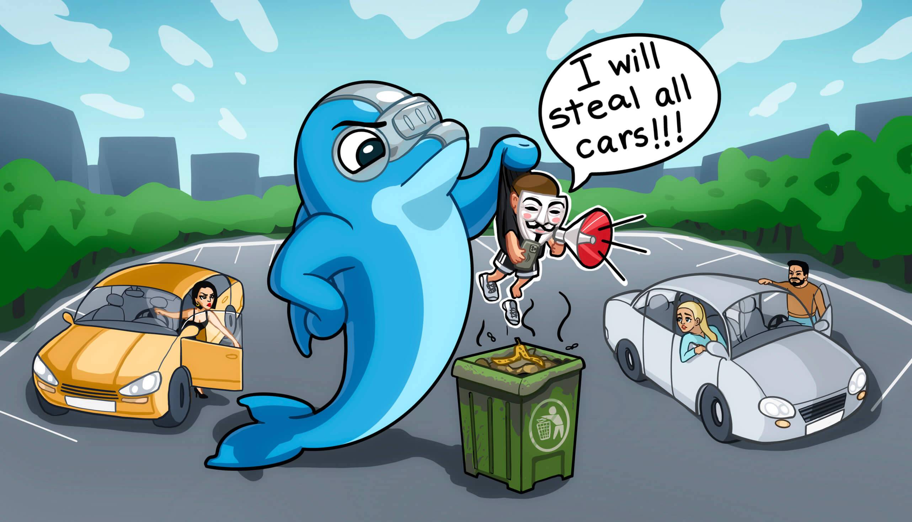
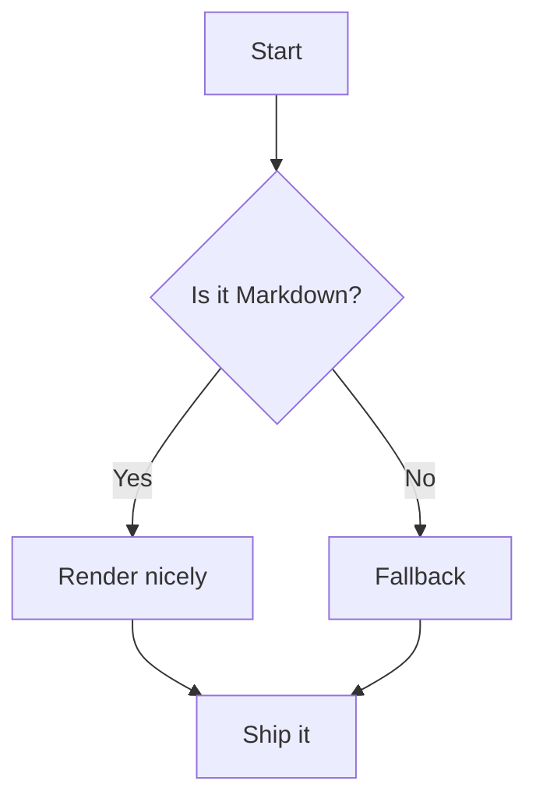
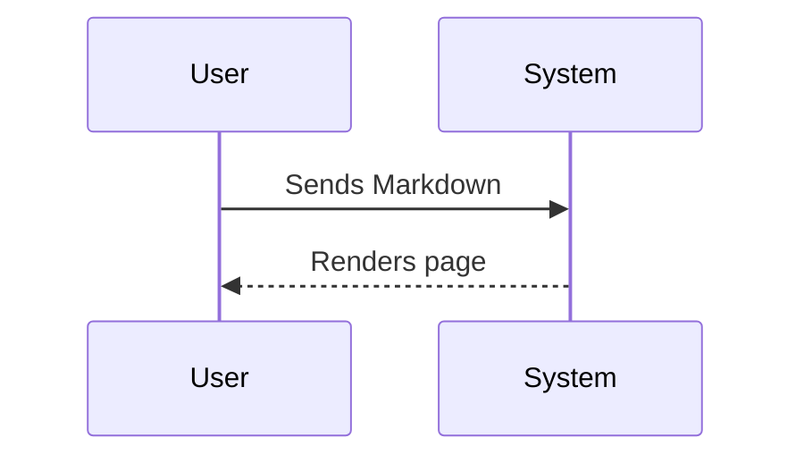

# Welcome

This is Welcome.md file


This is image from assets



Testing markdown syntax and how it's rendered in Archbee.

**Quick jump:**
- [Headings](#headings)
- [Text styles](#text-styles)
- [Links](#links)
- [Images](#images)
- [Videos & audio](#videos--audio)
- [Lists](#lists)
- [Task lists](#task-lists)
- [Tables](#tables)
- [Code & syntax highlighting](#code--syntax-highlighting)
- [Quotes & callouts](#quotes--callouts)
- [Details / accordion](#details--accordion)
- [Definition lists](#definition-lists)
- [Math](#math)
- [Mermaid diagrams](#mermaid-diagrams)
- [Footnotes](#footnotes)
- [Rules, escapes, emoji](#rules-escapes-emoji)
- [Inline HTML test](#inline-html-test)

---

## Headings

# H1 Heading
## H2 Heading
### H3 Heading
#### H4 Heading
##### H5 Heading
###### H6 Heading

Paragraph under headings. Line breaks work with two spaces at end.  
This is a second line.

---

## Text styles

Regular text, **bold**, *italic*, ***bold italic***, ~~strikethrough~~, <u>underline (HTML)</u>, `inline code`, <mark>highlight (HTML)</mark>, H~2~O (via HTML: H<sub>2</sub>O), 10^6 (via HTML: 10<sup>6</sup>).

Block of text with soft-wrap and hard-wrap differences.  
This line intentionally ends with two spaces to force a break.

---

## Links

- Inline link: [Archbee](https://archbee.com "Archbee site")
- Reference link: [GitHub][gh]
- Autolink: <https://example.com>
- Email: <mailto:hello@example.com>
- Anchor to a section: [Jump to Tables](#tables)
- Image-as-a-link: [](https://shields.io)

[gh]: https://github.com "GitHub Home"

---

## Images

Markdown images with alt + title:


Relative image path (may 404 in some viewers):


Reference-style image:

![Ref image][ref-img]

HTML image with width control:


[ref-img]: https://placehold.co/640x200?text=Reference+Image

---

## Videos & audio

**YouTube via linked thumbnail (common Markdown pattern):**

[](https://www.youtube.com/watch?v=dQw4w9WgXcQ)

**HTML5 `<video>` tag:**

<video src="https://interactive-examples.mdn.mozilla.net/media/cc0-videos/flower.mp4" controls width="480">
  Sorry, your browser doesn't support embedded videos.
</video>

**HTML5 `<audio>` tag:**

<audio controls>
  <source src="https://interactive-examples.mdn.mozilla.net/media/cc0-audio/t-rex-roar.mp3" type="audio/mpeg" />
  Your browser does not support the audio tag.
</audio>

---

## Lists

Unordered list:
- Item A
  - Nested A.1
    - Nested A.1.a
- Item B

Ordered list (start at 3):
3. Three
4. Four
5. Five

Mixed list:
- First
1. Second (numbered inside bullets)
- Third

---

## Task lists

- [x] Parse Markdown
- [x] Render tables
- [ ] Support admonitions
  - [x] Nested checked item
  - [ ] Nested unchecked item

---

## Tables

Basic table:

| Feature     | Supported | Notes              |
|-------------|:---------:|--------------------|
| Bold        | ✅        | `**text**`         |
| Italic      | ✅        | `*text*`           |
| Underline   | ⚠️        | HTML only          |
| Footnotes   | ✅        | See [below](#footnotes) |

Table with images & links:

| Avatar | User            | Link                                 |
|:------:|-----------------|--------------------------------------|
|  | **Alice**         | [Profile](https://example.com/alice) |
|  | **Bob**           | [Website](https://example.com)       |

---

## Code & syntax highlighting

Inline: `const hi = "world";`

Fenced (JavaScript):
```javascript
export function greet(name) {
  return `Hello, ${name}!`;
}
console.log(greet("Archbee"));
```

Fenced (Python):
```python
def fib(n):
    a, b = 0, 1
    seq = []
    while len(seq) < n:
        a, b = b, a + b
        seq.append(a)
    return seq

print(fib(10))
```

Fenced (Bash):
```bash
#!/usr/bin/env bash
set -euo pipefail
curl -I https://archbee.com
```

Diff block:
```diff
+ Added line
- Removed line
! Changed line (not standard, but some themes show this)
```

JSON block:
```json
{
  "name": "archbee-md-test",
  "private": true,
  "scripts": { "start": "node index.js" }
}
```

YAML block:
```yaml
name: archbee-md-test
on:
  push:
    branches: [ main ]
```

---

## Quotes & callouts

Regular blockquote:

> “Documentation is a love letter that you write to your future self.” — Damian Conway

GitHub/Docs-style admonitions (blockquote + label):

> [!NOTE]
> This is a note-style callout.
>
> [!TIP]
> Tips can sit under the same block.
>
> [!IMPORTANT]
> Important things deserve clear emphasis.
>
> [!WARNING]
> Warnings highlight risky steps.
>
> [!CAUTION]
> Use with care.

Nested blockquote:
> Outer quote
>> Inner quote

---

## Details / accordion

<details>
  <summary>Click to expand details</summary>
  
  Hidden content with **bold**, code `x = 42`, and a small list:
  - Point 1
  - Point 2
  
  Another paragraph.
</details>

---

## Definition lists

Term 1
: Definition for term 1

Term 2
: Multi-line definitions are fine.  
  Second line here.

---

## Math

Inline math: $E=mc^2$ and $\alpha + \beta = \gamma$.

Display math:

$$
\int_{-\infty}^{\infty} e^{-x^2} \, dx = \sqrt{\pi}
$$

---

## Mermaid diagrams

Flowchart:



Sequence diagram:



---

## Footnotes

Here is a statement that needs a footnote.[^1] And another one.[^long]

[^1]: Short footnote text.
[^long]: This is a longer footnote with **formatting**, links like [example](https://example.com), and even `inline code`.

---

## Rules, escapes, emoji

Horizontal rules:

---
***
___

Escaped characters: \*literal asterisks\*, \_underscores\_, \`backticks\`, \#hash.

Emoji shortcodes: :rocket: :tada: :zap: :warning:

---

## Inline HTML test

<kbd>Cmd</kbd> + <kbd>K</kbd> to open link dialog.

<button type="button">HTML Button</button>

<div style="padding:8px;border:1px dashed;">Inline HTML container with <strong>bold</strong> and <em>italic</em>.</div>

---

_The end. Back to [top](#archbee--github-markdown-torture-test)._
