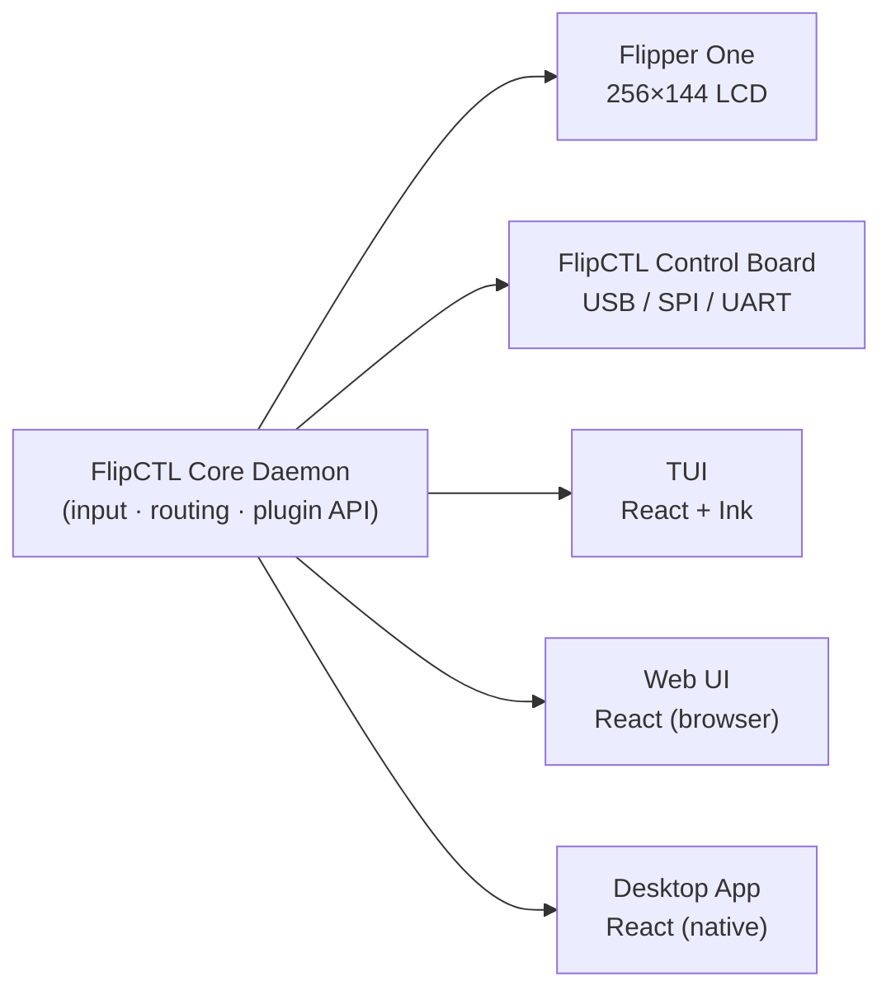

## Flipper's Universal Control Interface

::Image[]{src="https://api.archbee.com/api/optimize/3StCFqarJkJQZV-7N79yY/Z6pDHK17eiaaU9i2P0HQ9_flipctldraftlogo.png" size="30" width="900" height="900" position="center" alt="FlipCTL draft logo"}

:::BlockQuote
**TODO:** Make a proper FlipCTL logo
:::

FlipCTL is a **lightweight GUI framework for embedded and headless Linux systems**, designed as a modern replacement for traditional HMI solutions. Originally built for Flipper One, it runs on any Linux system — from servers and routers to single-board computers — with no desktop environment required.

The core idea: instead of running a desktop GUI (GNOME, KDE) on a tiny screen, FlipCTL provides a **pixel-rendered, navigation-friendly interface** — similar in spirit to `nmtui` or Midnight Commander, but graphically richer and hardware-aware.

***

## The Problem It Solves

Existing HMI solutions have several pain points:

- **Require a running graphical environment** (Xorg, Wayland) — unusable on headless servers, routers, or embedded devices
- **Desktop UIs are awkward** to navigate with a d-pad or joystick
- **CLI tools have no unified wrapper** — running something like `ping` or `nmap` interactively requires a keyboard and terminal
- **Existing control panels are complex** to install and configure

***

## The Vision

:::BlockQuote
`apt install flipctl` — and everything works.
:::

On any Linux system, with or without a display, FlipCTL should be immediately useful. Plug in the FlipCTL Control Board via USB, run the service, and you instantly have a working HMI — no Xorg, no desktop, no configuration.

***

## Supported Frontends

FlipCTL is designed around a renderer-agnostic core, allowing the same interface and plugins to be displayed across multiple input/output frontends:

<table isTableHeaderOn="true" columnWidths="331,332">
  <tr>
    <td>
      
Frontend

    </td>
    <td>
      
Description

    </td>
  </tr>
  <tr>
    <td>
      
<strong>Flipper One</strong>

    </td>
    <td>
      
The primary target device is an ARM Linux computer with a built-in 256×144 px LCD and physical controls. <strong>Includes boot menu functionality</strong> as part of the FlipCTL package

    </td>
  </tr>
  <tr>
    <td>
      
<strong>FlipCTL Control Board</strong>

    </td>
    <td>
      
A compact standalone module with a screen and buttons, connecting via USB, SPI, or UART — designed to add a physical HMI to any embedded system, server, single-board computer, or router

    </td>
  </tr>
  <tr>
    <td>
      
<strong>TUI (Terminal UI)</strong>

    </td>
    <td>
      
A pseudo-graphical interface rendered in any Linux terminal — usable locally or over SSH, similar to <code>nmtui</code> or Midnight Commander. <strong>May be built using React + Ink</strong> for component-based terminal rendering

    </td>
  </tr>
  <tr>
    <td>
      
<strong>Web UI</strong>

    </td>
    <td>
      
A browser-based interface served by the FlipCTL daemon — renders the same layout and navigation accessible from any device on the network. <strong>Can share the same React codebase as the Desktop App</strong>

    </td>
  </tr>
  <tr>
    <td>
      
<strong>Desktop App</strong>

    </td>
    <td>
      
A native desktop application for Linux, useful for development, testing, or general use on a full workstation. <strong>Can share the same React codebase as the Web UI</strong>

    </td>
  </tr>
</table>

***

## Hardware: FlipCTL Control Board

TODO: add picture of FlipCTL Control Board

A compact rectangular device built around a central **256×144 px LCD screen** with 64 shades of gray (6 bits per pixel). It connects to any Linux machine via **USB or SPI**, turning headless servers, routers, or embedded systems into machines with a physical HMI — no desktop environment required.

### Screen

- Resolution: **256 × 144 px**
- Depth: **6-bit grayscale** (64 shades)

### Input Controls

### Below the screen — 5 App-Defined Buttons (left to right)

TODO: Add controls schematics

<table isTableHeaderOn="true" columnWidths="331,332">
  <tr>
    <td>
      
Button

    </td>
    <td>
      
Default Role

    </td>
  </tr>
  <tr>
    <td>
      
<strong>Escape</strong>

    </td>
    <td>
      
Exit app / cancel / go back

    </td>
  </tr>
  <tr>
    <td>
      
<strong>View</strong>

    </td>
    <td>
      
Help, tooltips, toggle view mode

    </td>
  </tr>
  <tr>
    <td>
      
<strong>Power</strong>

    </td>
    <td>
      
Opens power overlay (sleep, backlight, reboot); hold = hardware shutdown regardless of system state

    </td>
  </tr>
  <tr>
    <td>
      
<strong>Edit</strong>

    </td>
    <td>
      
Edit fields, switch view types

    </td>
  </tr>
  <tr>
    <td>
      
<strong>Run</strong>

    </td>
    <td>
      
Confirm / OK / next step / start

    </td>
  </tr>
</table>

The **Power button** is intercepted at the microcontroller level — it works even if the OS is frozen, similar to a hardware power button on a standard PC.

### Left of the screen — Touchpad

A small touchpad for:

- Scrolling through long lists
- Navigating the on-screen keyboard
- Quick directional input (left / right / up / down)

### Right of the screen — 5-way D-Pad

Standard directional navigation: **up / down / left / right / center (OK)**

### Below the D-Pad — App Switcher

Shows all running applications and allows switching between them — similar to a double-tap home button on older phones.

### Right of the D-Pad — Back Button

Returns to the previous screen; functionally mirrors Escape in most contexts.

### Top of the device — PTT (Push-to-Talk)

A programmable button originally designed for walkie-talkie use (press and hold to transmit audio). On Flipper One it may serve secondary UI functions like screen lock. This button is **Flipper One-specific** and will likely not be present on the standalone FlipCTL Control Board.

***

## Out-of-the-Box Dashboard

Once installed, FlipCTL provides immediately useful information without any plugins:

- CPU load & uptime
- Disk usage
- Network configuration
- System reboot / shutdown

***

## Software Architecture

### Rendering Approach

The 256×144 px screen requires **pixel-level rendering**, which standard TUI libraries (ncurses, etc.) cannot provide. The proposed solution is an **HTML/CSS rendering engine** running as a background daemon — a lightweight browser-based renderer that draws menus, popups, and UI components.

The key principle: **data and UI logic are separated from the renderer**. The same data can be displayed differently depending on the frontend:

- Pixel-rendered on the LCD
- Character-rendered in a terminal (React + Ink)
- HTML in a browser (React)

### Core Daemon + Plugin System

FlipCTL runs as a **system daemon** with a plugin architecture:

- The **core daemon** handles input, routing, rendering communication, and the plugin API
- **Plugins** are wrappers around CLI tools or services, written in any language

### Plugin / Wrapper Bindings

Developers can write wrappers in whatever language they prefer:

- **Python** — e.g., a wrapper for `nmap` or `nginx` stats
- **Bash** — quick scripts for simple tools
- **Rust, Node.js, Go** — for performance-critical or complex plugins

Example: a `ping` plugin presents a menu to enter a host/IP, runs the underlying `ping` command, and displays live output — all navigable with the d-pad.

**Example plugins:** `ping` · `nmap` · `traceroute` · `nginx status` · `iptables` · `disk manager`

***

## Summary

FlipCTL is equal parts **software framework** and **hardware platform** — a universal, headless-friendly HMI layer for Linux, designed for the Flipper One but useful for any embedded or server system. Its install-and-run simplicity and language-agnostic plugin system make it a practical tool for anyone who needs a physical or remote interface without the overhead of a full desktop environment.
