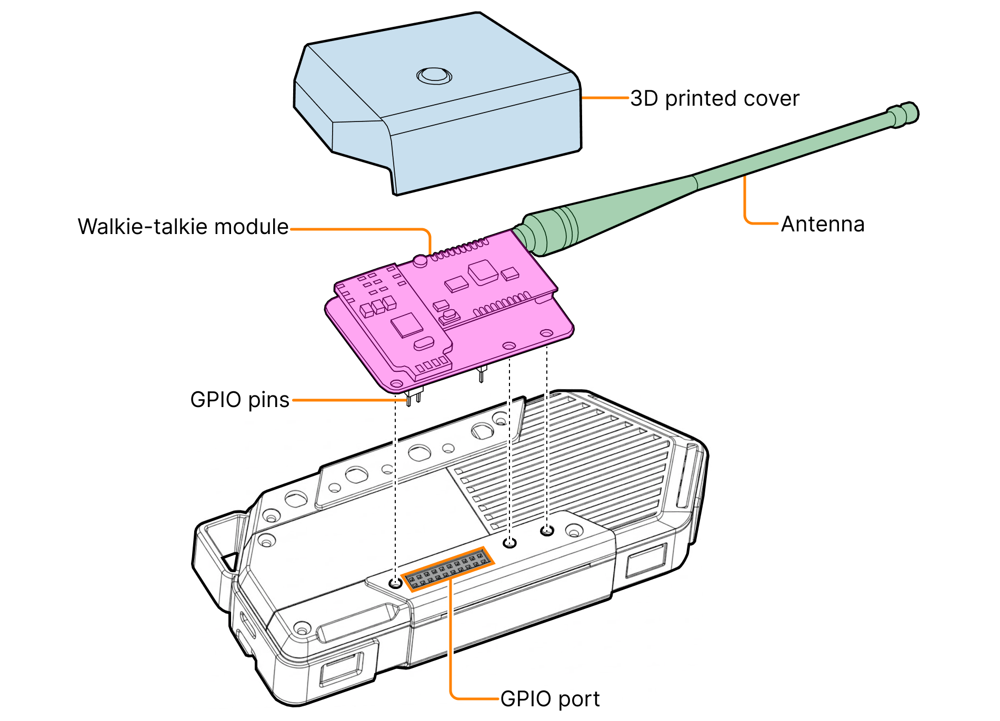

This page showcases hardware modules that can be created for Flipper One and connected via the GPIO port. Two modules are currently documented: the walkie-talkie module and the camera module.

***

## Walkie-talkie module

This module enables communication over standard VHF frequencies with walkie-talkies using the Flipper One microphone, speaker, and PTT button. It is built around an SA828-based walkie-talkie radio module.

The module connects to Flipper One via the GPIO header's USB 2.0 pins (D+, D-, 5V, GND) and carries microphone audio, speaker audio, and a PTT control signal between Flipper One and the radio. RF transmission and reception go through an external antenna attached to the SA828 module.

***

## Camera module

This module turns Flipper One into a point-and-shoot camera for capturing pixel art images, with a live preview rendered on the built-in screen at 256 × 144 pixels and 64 greyscale levels.

Flipper One's Linux OS recognizes the module as a standard USB webcam, making it available for taking pictures and recording videos. The camera module is based on a typical USB webcam, connecting via the USB 2.0 pins (D+, D-, GND) and powered through the 5V output pin on the GPIO header.
