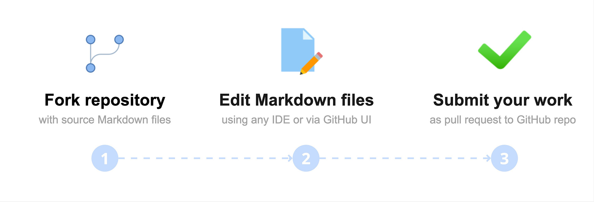

# Title

The Developer Portal — also called the wiki or the Docs — is the main documentation for Flipper One sub-projects. We update it as we work on Flipper One, so some pages may be out of date. This page explains how the Docs are organized, how pages are stored and published, and how you can contribute.


The Docs sub-project covers all documentation for Flipper One: this wiki, technical specs, datasheets, guides, and contribution instructions. Like all other Flipper One sub-projects, it is open for community contribution.

The Docs sub-project consists of:

- ✅ :Link[Task tracker]{href="https://github.com/orgs/flipperdevices/projects/10" newTab="true" hasDisabledNofollow="true"}
- 📁 :Link[Source Markdown files on GitHub]{href="https://github.com/flipperdevices/flipperone-docs" newTab="true" hasDisabledNofollow="true"}
- 📊 :Link[Diagrams on Miro]{href="https://miro.com/app/board/uXjVJ6y839o=/?moveToWidget=3458764666602002588&cot=10" newTab="true" hasDisabledNofollow="true"}
- 🎨 :Link[Illustrations on Figma]{href="https://www.figma.com/design/HcwlmmIJlW4LoiQu4RtwwH/Flipper-One-%E2%80%94-Docs?node-id=71-3&t=56y5oAygKLBg3nGe-1" newTab="true" hasDisabledNofollow="true"}

We'd love your feedback and help — look for tasks tagged **help wanted** in the task tracker, or contribute directly to the Docs GitHub repository via pull requests.


***

## ✅ Task tracker

All Docs sub-project tasks are tracked in the GitHub project [Flipper One — Docs](https://github.com/orgs/flipperdevices/projects/10). There, you can see what the team is working on and find open tasks where the community can help.


Tasks labeled **help wanted** are open for contribution. You're welcome to join discussions or submit changes — just read the :Link[Contribution guide]{href="https://docs.flipper.net/one/about-docs#how-to-contribute" newTab="false" hasDisabledNofollow="true"} first.

***

## How the Developer Portal works

The Flipper One Developer Portal is hosted on [Archbee](https://archbee.com), but all source files live in the :Link[GitHub repository]{href="https://github.com/flipperdevices/flipper-one-docs" newTab="true" hasDisabledNofollow="false"} — made possible by Archbee's GitHub integration. Diagrams, screenshots, and illustrations are created in Miro and Figma, then exported to the repository alongside the Markdown.


The repository uses two long-lived branches:

- **`dev`** — staging branch for documentation contributions. All pull requests from contributors target `dev` first, so changes can be reviewed, edited, and previewed without affecting the live site.
- **`public-release`** — production branch connected to Archbee. Once changes on `dev` are reviewed and ready, we promote them to `public-release`, which triggers Archbee to rebuild and publish the live docs at :Link[docs.flipper.net/one]{href="https://docs.flipper.net/one" newTab="true" hasDisabledNofollow="false"}.

***

## GitHub repository structure

The repository contains the source files for the entire Developer Portal:

```none
flipperone-docs/
├── archbee.json           # Sidebar hierarchy + Archbee integration settings
├── README.md              # Repository overview
├── tools/
│   └── generate_open_tasks.py  # Generates Open-tasks.md from GitHub issues
└── docs/
    ├── Welcome.md         # Main page at docs.flipper.net/one
    ├── How-to-join.md
    ├── Open-tasks.md      # Auto-generated — do not edit manually
    ├── files/
    │   └── pics/          # Images and other assets
    ├── general/
    ├── hardware/
    ├── mechanics/
    ├── mcu-firmware/
    ├── cpu-software/
    ├── user-interface/
    ├── testing/
    └── resources/
```

***

### Markdown and Archbee syntax

All pages in the Developer Portal are written in **Markdown** (`.md`) — the same format used for GitHub READMEs and most open-source documentation. On top of standard Markdown, Archbee adds a set of components for callouts, tabs, workflow blocks, embedded media, and more.

For the full list of supported syntax with live examples, see the :Link[Markup example]{href="https://docs.flipper.net/one/markup-example" newTab="true" hasDisabledNofollow="false"} page. It covers:

- Headings, lists, links, and tables
- Callouts
- Images and videos
- Code blocks and tabbed code
- Workflow steps and other Archbee components

:::hint{type="info"}
Always check the :Link[Markup example]{href="https://docs.flipper.net/one/markup-example" newTab="true" hasDisabledNofollow="false"} page before writing or editing — some Markdown features behave differently in Archbee, and component syntax can be easy to mistype.
:::

***

### Images and other assets

All images, diagrams, and screenshots live in a single folder: `docs/files/pics/`. Keeping everything in one place makes it easier to find, reuse, and clean up unused files.

To use an image in a page, reference it from your Markdown using a relative path:

```markdown

```

For richer Archbee image syntax (positioning, captions, sizing), see the :Link[Markup example]{href="https://docs.flipper.net/one/markup-example" newTab="true" hasDisabledNofollow="false"} page.
‎ 

**Naming and size guidelines:**

- Use descriptive, lowercase filenames with hyphens — for example, `gpio-pinout.png`, not `IMG_0042.PNG`.
- Compress large screenshots before committing. Keep individual files under a few MB where possible.
- Prefer `.png` for screenshots and diagrams, `.jpg` for photos.

***

### How archbee.json works

`archbee.json` lives at the repo root and defines the left sidebar (table of contents) of the Developer Portal — sections, page names, file paths, and nesting levels.

When adding a new page, always update :Link[archbee.json]{href="https://github.com/flipperdevices/flipperone-docs/blob/public-release/archbee.json" newTab="true" hasDisabledNofollow="false"} to include it. Without this, the page will not appear in the sidebar, and readers won't be able to find it.

**Syntax**

The sidebar tree lives in `structure.docsTree` — an array of entries that are either pages or category groups. For example:

```json
{
  "root": "./docs",
  "structure": {
    "readme": "Welcome.md",
    "assets": "files",
    "docsTree": [
      {
        "categoryName": "Welcome",
        "isCategory": false,
        "path": "Welcome.md",
        "children": []
      },
      {
        "categoryName": "🔌 Hardware",
        "isCategory": true,
        "children": [
          {
            "categoryName": "About Hardware",
            "isCategory": false,
            "path": "hardware/About-Hardware.md",
            "children": []
          },
          {
            "categoryName": "Expansion modules",
            "isCategory": false,
            "path": "hardware/modules/Expansion-modules.md",
            "children": [
              {
                "categoryName": "GPIO modules",
                "isCategory": false,
                "path": "hardware/modules/GPIO-Modules.md",
                "children": []
              }
            ]
          }
        ]
      }
    ]
  }
}
```

‎&#x20;

**Rules**

- Pages are entries with a path to an `.md` file inside `docs/`.
- Categories are group headers that visually separate sections (for example, 🔌 Hardware). They have no path — only nested entries.
- Any page can also have nested sub-pages under it.
- The sidebar label comes from `categoryName`. Emojis render as-is and are purely cosmetic.

:::hint{type="info"}
**Page names in the sidebar** come from the first H1 heading (`#`) in the `.md` file — not from `categoryName` in `archbee.json`. Keep page titles short so they fit comfortably in the sidebar.

This is a known issue — we notified Archbee.
:::

‎&#x20;

**Adding a new page**

1. Create the `.md` file under `docs/...`
2. Add an entry for it in `archbee.json` → `structure.docsTree` at the right place in the hierarchy. Ideally, nesting should not go deeper than two levels.
3. Open a pull request to the `dev` branch. After review, your changes are promoted to `public-release`, which rebuilds the live site.

***

## 📊 Diagrams on Miro

All diagrams used in the Developer Portal, architecture overviews, flow charts, and conceptual visuals are designed on the [Flipper One — Docs Miro board](https://miro.com/app/board/uXjVJ6y839o=/).

The board is publicly viewable: anyone can open it, inspect existing diagrams and templates, and export a copy for reference or offline editing.

:::hint{type="info"}
Spotted an error or have an idea for a new diagram? Share them with us in a :Link[pull request]{href="https://docs.flipper.net/one/about-docs#share-fixes-and-guides-as-a-pull-request" newTab="true" hasDisabledNofollow="false"}.
:::

***

## 🎨 Illustrations on Figma

Illustrations used across the Developer Portal — section illustrations and decorative graphics are designed in the [Flipper One — Docs Figma file](https://www.figma.com/design/HcwlmmIJlW4LoiQu4RtwwH/Flipper-One-%E2%80%94-Docs).

Like the Miro board, the Figma file is publicly viewable: you can browse every frame, inspect layers, and export illustrations at any resolution.

:::hint{type="info"}
Have an idea for a new illustration or a tweak to an existing one? Share them with us in a :Link[pull request]{href="https://docs.flipper.net/one/about-docs#share-fixes-and-guides-as-a-pull-request" newTab="true" hasDisabledNofollow="false"}.
:::

***

## How to contribute

:::hint{type="info"}
To contribute to the Docs sub-project, you need to have a GitHub account. You can create one on the :Link[GitHub website]{href="https://github.com/signup" newTab="true" hasDisabledNofollow="false"}.
:::



Anyone can contribute to the Docs sub-project:

**Step 0:** Check open tasks in the :Link[task tracker]{href="https://github.com/orgs/flipperdevices/projects/10" newTab="true" hasDisabledNofollow="false"} and read the :Link[Markup example]{href="https://docs.flipper.net/one/markup-example" newTab="true" hasDisabledNofollow="false"} page to learn the supported Markdown and Archbee syntax.

**Step 1:** Fork the :Link[flipperone-docs]{href="https://github.com/flipperdevices/flipperone-docs" newTab="true" hasDisabledNofollow="false"} repository.

**Step 2:** Edit Markdown files in the `docs/` folder.

**Step 3:** Submit your work as a **pull request** to our GitHub repo.

***

### Submit your fix or guide as a pull request

If you've spotted an error, want to clarify a section, or want to add a new guide, you're welcome to contribute. Fork the repository, make your changes on a new branch, and submit a pull request to the original repository:

::::WorkflowBlock
:::WorkflowBlockItem
Read the :Link[Markup example]{href="https://docs.flipper.net/one/markup-example" newTab="true" hasDisabledNofollow="false"} page to learn the supported Markdown and Archbee syntax before writing or editing pages.
:::

:::WorkflowBlockItem
Go to the :Link[flipperone-docs]{href="https://github.com/flipperdevices/flipperone-docs" newTab="true" hasDisabledNofollow="false"} repository and fork it to your account by clicking the **Fork** button in the upper-right corner.

Your fork opens on the `dev` branch — the staging branch for contributions. All your work happens here; you don't need to switch branches.


:::

:::WorkflowBlockItem
In your forked repository, find the `.md` file you want to edit under `docs/`, or create a new one in the appropriate subfolder.

When writing or editing, follow the supported Markdown and Archbee syntax shown on the :Link[Markup example]{href="https://docs.flipper.net/one/markup-example" newTab="true" hasDisabledNofollow="false"} page — some Markdown features behave differently in Archbee, and component syntax can be easy to mistype.
:::

:::WorkflowBlockItem
(Optional) If your change includes **images, diagrams, or screenshots**, upload them to the `docs/files/pics/` folder and reference them from your Markdown using a relative path:

```markdown

```

Use descriptive, lowercase filenames with hyphens (for example, `gpio-pinout.png`). Keep images under 1 MB where possible — compress large screenshots before committing.
:::

:::WorkflowBlockItem
(Optional) If you are **adding a new page**, you can also edit :Link[archbee.json]{href="https://github.com/flipperdevices/flipperone-docs/blob/public-release/archbee.json" newTab="true" hasDisabledNofollow="false"} to add it to the sidebar hierarchy. Ideally, nesting should not go deeper than two levels.

It's okay if you don't do it — we'll update this file after merging your PR with a new page.
:::

:::WorkflowBlockItem
Create a new branch in your fork and commit your changes to it. Since the fork's default branch is `dev`, your new branch is automatically based on it.

Name the branch using your GitHub nickname and a short description of what changed: `nickname/what-changed`. For example: `john/github-integration-update`.

Keep the commit description concise and clear. For example: `Update: rename authentication to auth`.
:::

:::WorkflowBlockItem
Open a pull request from your branch to the original repository. The target branch is pre-selected to `dev` — leave it as is. Add a clear title and description explaining what you changed.

After review, we promote your changes from `dev` to `public-release`, which publishes them to the live site.

We highly recommend attaching screenshots that show what changed and a link to the open task this pull request is associated with.
:::
::::

Once your pull request is merged into `dev` and later promoted to `public-release`, Archbee automatically picks up the changes and rebuilds the live site at :Link[docs.flipper.net/one]{href="https://docs.flipper.net/one" newTab="true" hasDisabledNofollow="false"}.

***

### Suggest your change as a comment on an open task

::::hint{type="info"}
**⚠️ Contributions only — no flooding**

To keep collaboration productive, please keep comments on-topic. Open tasks are for contribution-related discussion only. If you have an idea or concern, first turn it into a concrete contribution and share it as a comment on a task. For general questions or discussions, you’re always welcome to join the conversation on :Link[social media]{href="https://x.com/Flipper_RND" newTab="true" hasDisabledNofollow="false"} or :Link[Discord]{href="https://discord.com/invite/flipper" newTab="true" hasDisabledNofollow="false"}!

::::

Open tasks that need the community's help are labeled **help wanted**. If you have ideas on how to improve a page, you can contribute by commenting on the task and attaching screenshots, videos, or links:

:::::WorkflowBlock
:::WorkflowBlockItem
In the :Link[Docs GitHub project]{href="https://github.com/orgs/flipperdevices/projects/10" newTab="true" hasDisabledNofollow="false"}, click the open task you want to contribute to.
:::

::::WorkflowBlockItem
In the comments section, clearly describe your suggestion and, if helpful, attach a screenshot, video, or link to a draft pull request.

:::hint{type="info"}
**Important:** If you share a link, ensure the content is accessible to others. If you've already prepared a fix as a pull request, target the `dev` branch — see :Link[Submit your fix or guide as a pull request]{href="https://docs.flipper.net/one/about-docs#submit-your-fix-or-guide-as-a-pull-request" newTab="false" hasDisabledNofollow="true"}.
:::


**Attachment size limit:**

- Images: 10 MB
- Videos: 100 MB
::::

:::WorkflowBlockItem
Click **Comment**.
:::
:::::

We review all comments carefully! We may ask additional questions about your idea in the task thread, so please follow notifications from GitHub in your email.
