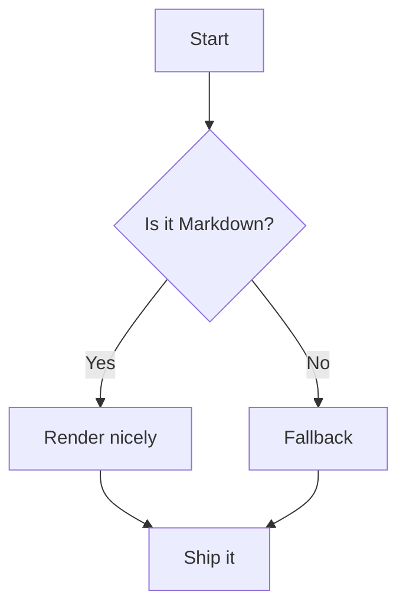
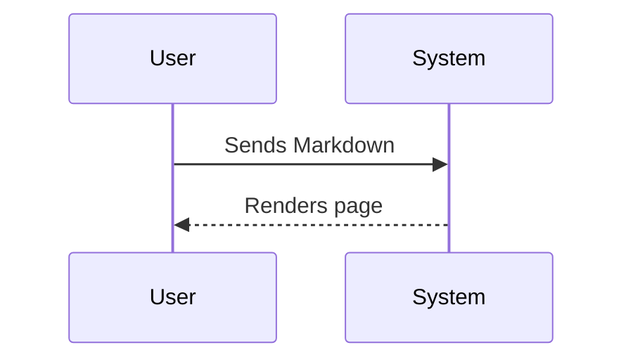

# Markup Reference

This page is a reference for contributors writing Flipper One documentation.
It covers both standard **Markdown** and **Archbee-specific syntax** supported by this wiki.

The source files live on GitHub at [github.com/flipperdevices/flipper-one-docs](https://github.com/flipperdevices/flipper-one-docs). Every merged pull request automatically rebuilds the live site. To contribute, fork the repo and open a pull request.

**Quick jump:**

- [Headings](./#headings)
- [Text styles](./#text-styles)
- [Links](./#links)
- [Images](./#images)
- [Videos](./#videos)
- [Lists](./#lists)
- [Tables](./#tables)
- [Code](./#code--syntax-highlighting)
- [Callouts](./#callouts)
- [Math](./#math)
- [Mermaid diagrams](./#mermaid-diagrams)
- [Archbee components](./#archbee-components)

***

## Headings

Flipper One documentation supports headings H1–H3. Use H1 for page-level sections, H2 for subsections, H3 for sub-subsections.

| **Flipper One docs** | **Markdown** |
| --- | --- |
| # Heading H1 | `# Heading H1` |
| ## Heading H2 | `## Heading H2` |
| ### Heading H3 | `### Heading H3` |

***

## Text styles

| **Flipper One docs** | **Markdown** |
| --- | --- |
| Regular text | `Regular text` |
| **Bold** | `**Bold**` |
| *Italic* | `*Italic*` |
| <u>Underline</u> | `__Underline__` |
| ***Bold italic*** | `***Bold italic***` |
| ~~Strikethrough~~ | `~~Strikethrough~~` |
| `Inline code` | `` `Inline code` `` |

***

## Links

| **Flipper One docs** | **Markdown** |
| --- | --- |
| [Archbee](https://archbee.com) | `[Archbee](https://archbee.com)` |
| [https://example.com](https://example.com) | `[https://example.com](https://example.com)` |
| [Jump to Tables](./#tables) | `[Jump to Tables](./#tables)` |

***

## Images

Standard Markdown image syntax:

| **Flipper One docs** | **Markdown** |
| --- | --- |
| **Remote URL**  | `` |
| **Local path**  | `` |

:::hint{style="info"}
**Caption alignment** depends on the image source, not the syntax:
- **Remote URL** — caption is rendered **centered**
- **Local path** — caption is rendered **left-aligned**
:::

To **resize or align** an image, standard Markdown is not enough — use Archbee syntax:

`::Image[]{src="files/pics/test-image.jpg" size="40" position="flex-start" caption="Caption text"}`

| Attribute | Description |
| --- | --- |
| `src` | Path to the image (relative or absolute URL) |
| `size` | Width value (exact unit unclear — likely a percentage of the content area) |
| `position` | Page alignment when image is smaller than content area: `flex-start` (left), `center`, `flex-end` (right). Has no effect on caption alignment. |
| `caption` | Optional caption shown below the image. Always left-aligned for local images. |

***

## Videos

Two ways to embed video are supported.

**YouTube** — use Archbee's embed syntax:

`::embed[]{url="https://www.youtube.com/watch?v=VIDEO_ID"}`

::embed[]{url="https://www.youtube.com/watch?v=dQw4w9WgXcQ"}

**Self-hosted / CDN video** — use an HTML `<video>` tag:

```html
<video
    autoplay muted loop playsinline style="width: 100%; margin: 0 !important;"
    src="https://cdn.example.com/your-video.mp4"
></video>
```

<video
    autoplay muted loop playsinline style="width: 100%; margin: 0 !important;"
    src="https://cdn.flipperzero.one/Pan_rotate_and_move_parts_compressed.mp4"
></video>

***

## Lists

<table isTableHeaderOn="true" columnWidths="330,330">
  <tr>
    <td><p><strong>Flipper One docs</strong></p></td>
    <td><p><strong>Markdown</strong></p></td>
  </tr>
  <tr>
    <td>
      <ul>
        <li>Item A
          <ul><li>Nested A.1</li></ul>
        </li>
        <li>Item B</li>
      </ul>
    </td>
    <td><p><code>- Item A</code><br /><code>&nbsp;&nbsp;- Nested A.1</code><br /><code>- Item B</code></p></td>
  </tr>
  <tr>
    <td>
      <ol>
        <li>First</li>
        <li>Second</li>
        <li>Third</li>
      </ol>
    </td>
    <td><p><code>1. First</code><br /><code>2. Second</code><br /><code>3. Third</code></p></td>
  </tr>
  <tr>
    <td>
      <ul>
        <li><input type="checkbox" disabled /> Item A</li>
        <li><input type="checkbox" disabled /> Item B</li>
      </ul>
    </td>
    <td><p><code>[] Item A</code><br /><code>[] Item B</code></p></td>
  </tr>
</table>

***

## Divider

Use `***` or `---` to insert a horizontal divider:

***

## Tables

Archbee supports two table formats.

**Standard Markdown pipe tables** — simple and readable, but no control over column widths or alignment:

```markdown
| Column 1 | Column 2 | Column 3 |
| --- | --- | --- |
| Cell | **Bold** | ✅ |
```

| Column 1 | Column 2 | Column 3 |
| --- | --- | --- |
| Cell | **Bold** | ✅ |

**HTML tables** — use when you need column widths, cell alignment, or images inside cells:

```html
<table isTableHeaderOn="true" columnWidths="165,330,165">
  <tr>
    <td><p>Header 1</p></td>
    <td><p>Header 2</p></td>
    <td align="center"><p>Header 3</p></td>
  </tr>
  <tr>
    <td><p>Cell</p></td>
    <td><p><strong>Bold cell</strong></p></td>
    <td align="center"><p>✅</p></td>
  </tr>
</table>
```

<table isTableHeaderOn="true" columnWidths="165,330,165">
  <tr>
    <td><p>Attribute</p></td>
    <td><p>Description</p></td>
    <td><p>Example</p></td>
  </tr>
  <tr>
    <td><p><code>isTableHeaderOn</code></p></td>
    <td><p>Renders the first row as a bold header</p></td>
    <td><p><code>"true"</code> / <code>"false"</code></p></td>
  </tr>
  <tr>
    <td><p><code>columnWidths</code></p></td>
    <td><p>Comma-separated pixel widths per column. Total must not exceed 660 px</p></td>
    <td><p><code>"220,440,220"</code></p></td>
  </tr>
  <tr>
    <td><p><code>align</code></p></td>
    <td><p>Horizontal alignment on a <code>&lt;td&gt;</code> element</p></td>
    <td><p><code>align="center"</code></p></td>
  </tr>
</table>

***

## Code & syntax highlighting

**Fenced block with language:**

````markdown
```javascript
function greet(name) {
  return `Hello, ${name}!`;
}
```
````

```javascript
function greet(name) {
  return `Hello, ${name}!`;
}
```

**Diff block:**

````markdown
```diff
+ Added line
- Removed line
```
````

```diff
+ Added line
- Removed line
```

Supported language tags: `javascript`, `typescript`, `python`, `bash`, `c`, `cpp`, `json`, `yaml`, `diff`, `tex`, `mermaid`.

***

## Callouts

Archbee supports four callout styles using `:::hint{style="..."}`:

:::hint{style="info"}
**info** — General information or context.

`:::hint{style="info"} Your text here :::`
:::

:::hint{style="success"}
**success** — Positive outcome or confirmation.

`:::hint{style="success"} Your text here :::`
:::

:::hint{style="warning"}
**warning** — Something to be careful about.

`:::hint{style="warning"} Your text here :::`
:::

:::hint{style="danger"}
**danger** — Risk of data loss or breaking change.

`:::hint{style="danger"} Your text here :::`
:::

***

## Math

Archbee only supports math via a fenced `tex` block. Inline math (`$...$`) is **not supported**.

````markdown
```tex
\int_{-\infty}^{\infty} e^{-x^2} \, dx = \sqrt{\pi}
```
````

```tex
\int_{-\infty}^{\infty} e^{-x^2} \, dx = \sqrt{\pi}
```

***

## Mermaid diagrams

Use a fenced `mermaid` block. Supported diagram types: `flowchart`, `sequenceDiagram`, `classDiagram`, `gantt`, and more.





***

## Archbee components

### Workflow steps

Use `WorkflowBlock` with `WorkflowBlockItem` for numbered step-by-step flows:

```markdown
::::WorkflowBlock
:::WorkflowBlockItem
Step one title

Step description.
:::

:::WorkflowBlockItem
Step two title

Step description.
:::
::::
```

::::WorkflowBlock
:::WorkflowBlockItem
Step one title

Step description.
:::

:::WorkflowBlockItem
Step two title

Step description.
:::
::::

***

### Two-column layout

Use `VerticalSplit` to place content side by side:

```markdown
::::VerticalSplit{layout="middle"}
:::VerticalSplitItem
**Left side**

Content
:::

:::VerticalSplitItem
**Right side**

Content
:::
::::
```

::::VerticalSplit{layout="middle"}
:::VerticalSplitItem
**Left side**

Content
:::

:::VerticalSplitItem
**Right side**

Content
:::
::::

***

### Expandable section

Use `ExpandableHeading` for collapsible content:

```markdown
:::ExpandableHeading
### Section title

Content shown when expanded.
:::
```

:::ExpandableHeading
### Section title

Content shown when expanded.
:::

