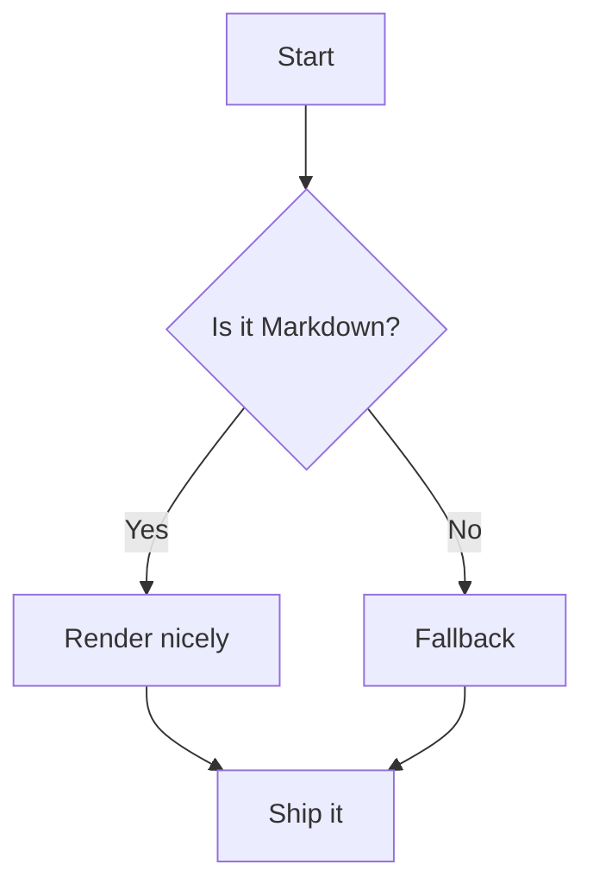
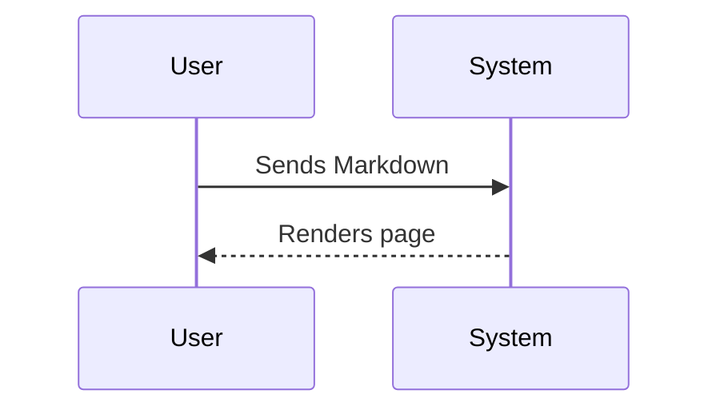

# Markup Example

This page contains examples of markup that can be used in this wiki.  
It supports basic **Markdown**, but also includes some **Archbee-specific syntax**.

This wiki is powered by the [Archbee documentation system](https://archbee.com) and is connected to the public GitHub repository [github.com/flipperdevices/flipper-one-docs](https://github.com/flipperdevices/flipper-one-docs).  
That means anyone can suggest edits to any page, and once the Flipper team approves them, the changes will appear in this documentation.

## GitHub Sources

The source files for this wiki are stored in the [github.com/flipperdevices/flipper-one-docs](https://github.com/flipperdevices/flipper-one-docs).  
To edit any page, create a **pull request** with your changes: [FIX How to make a pull request to this wiki](LINK).

Each time a change is committed to the GitHub repository, the wiki is automatically rebuilt and updated on the website.

# Archbee Markup

This wiki supports **Markdown** formatting, but not all features are available.  
In some cases, you’ll need to use **Archbee-specific tags**.


**Quick jump:**
- [Headings](#headings)
- [Text styles](#text-styles)
- [Links](#links)
- [Images](#images)
- [Videos & audio](#videos)
- [Lists](#lists)
- [Tables](#tables)
- [Code & syntax highlighting](#code--syntax-highlighting)
- [Quotes & callouts](#quotes--callouts)
- [Math](#math)
- [Mermaid diagrams](#mermaid-diagrams)
- [Rules, escapes, emoji](#rules-escapes-emoji)
- [Archbee syntax](#testing-archbee-syntax)

---

## Headings

# H1 Heading
## H2 Heading
### H3 Heading <- Can't go any lower

Paragraph under headings. Line breaks work with two spaces at end.  
This is a second line.

---

## Text styles

- Regular text 
- **bold**
- *italic*
- ***bold italic***
- ~~strikethrough~~
- `inline code`
- $10^6$
- $H_2O$

Block of text with soft-wrap and hard-wrap differences.  
This line intentionally ends with two spaces to force a break.

---

## Links

- Inline link: [Archbee](https://archbee.com "Archbee site")
- Autolink: <https://example.com>
- Anchor to a section: [Jump to Tables](#tables)

---

## Images

Markdown images with alt + title:


Relative image path:


## Archbee image resize and align

The only way to resize image is archbee syntax:

`::Image[]{src="files/pics/test-image.jpg" size="40" position="left" caption="This is caption of text image, resized to 40 px ang alignet to left"}`

::Image[]{src="files/pics/test-image.jpg" size="40" position="left" caption="This is caption of text image, resized to 40 px ang alignet to left"}


---

## Videos

**YouTube via linked thumbnail (common Markdown pattern):**

[](https://www.youtube.com/watch?v=dQw4w9WgXcQ)

---

## Lists

Unordered list:
- Item A
  - Nested A.1
    - Nested A.1.a
- Item B

Ordered list (start at 3):
3. Three
4. Four
5. Five

Mixed list:
- First
1. Second (numbered inside bullets)
- Third

---

## Tables

Basic table:

| Feature     | Supported | Notes              |
|-------------|:---------:|--------------------|
| Bold        | ✅        | **text**           |
| Italic      | ✅        | *text*             |
| Footnotes   | ✅        | See [below](#footnotes) |

Table with images & links:

| Avatar | User            | Link                                 |
|:------:|-----------------|--------------------------------------|
|  | **Alice**         | [Profile](https://example.com/alice) |
|  | **Bob**           | [Website](https://example.com)       |

---

## Code & syntax highlighting

Inline: `const hi = "world";`

Fenced (JavaScript):
```javascript
export function greet(name) {
  return `Hello, ${name}!`;
}
console.log(greet("Archbee"));
```

Fenced (Python):
```python
def fib(n):
    a, b = 0, 1
    seq = []
    while len(seq) < n:
        a, b = b, a + b
        seq.append(a)
    return seq

print(fib(10))
```

Fenced (Bash):
```bash
#!/usr/bin/env bash
set -euo pipefail
curl -I https://archbee.com
```

Diff block:
```diff
+ Added line
- Removed line
! Changed line (not standard, but some themes show this)
```

JSON block:
```json
{
  "name": "archbee-md-test",
  "private": true,
  "scripts": { "start": "node index.js" }
}
```

YAML block:
```yaml
name: archbee-md-test
on:
  push:
    branches: [ main ]
```

---

## Quotes & callouts

Regular blockquote:

> “Documentation is a love letter that you write to your future self.” — Damian Conway

GitHub/Docs-style admonitions (blockquote + label):

> [!NOTE]
> This is a note-style callout.

> [!TIP]
> Tips can sit under the same block.

> [!IMPORTANT]
> Important things deserve clear emphasis.

> [!WARNING]
> Warnings highlight risky steps.

> [!CAUTION]
> Use with care.

> 💡 **Tip:** Remember to save your work often.

:::hint{type="info"}
### Heading inside a callout
Archbee uses its own syntax for callouts. Available styles: info, warning, success, danger.
:::

---

## Math

Inline math: $E=mc^2$ and $\alpha + \beta = \gamma$.

Display math (used Archbee syntax):

```tex
\int_{-\infty}^{\infty} e^{-x^2} \, dx = \sqrt{\pi}
```

---

## Mermaid diagrams

Flowchart:



Sequence diagram:



---

## Rules, escapes, emoji

Horizontal rules:

---
***
___

Escaped characters: \*literal asterisks\*, \_underscores\_, \`backticks\`, \#hash.

Emoji shortcodes: :rocket: :tada: :zap: :warning:

---
# Testing archbee syntax

## Flow with steps

::::WorkflowBlock
:::WorkflowBlockItem
Included subitems

1. Subitem 1
2. Subitem 2
:::

:::WorkflowBlockItem
Added text

Text body
:::

:::WorkflowBlockItem
Added image


:::
::::

## Formula

```tex
int_0^infty x^2 dx
```

## Callouts

:::hint{type="info"}
Test
:::

:::hint{type="success"}

:::

:::hint{type="warning"}

:::

:::hint{type="danger"}

:::


## Vertical divider

::::VerticalSplit{layout="middle"}
:::VerticalSplitItem
**Left side**

Text
:::

:::VerticalSplitItem
**Right side**

Text
:::
::::

## Expandible text

:::ExpandableHeading
### Expandible heading

With text
More text


:::

