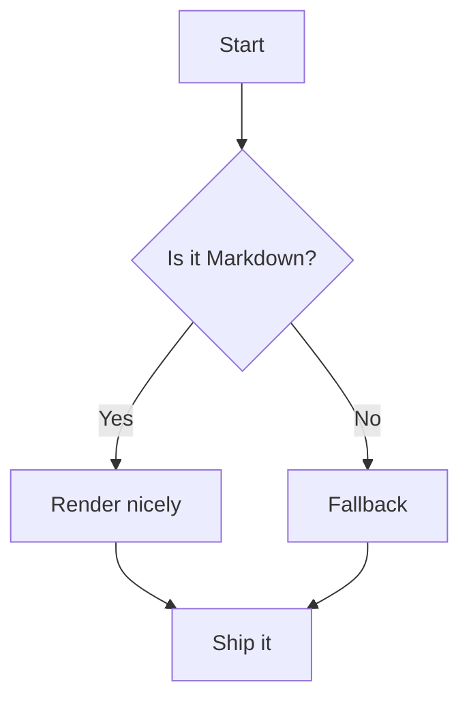
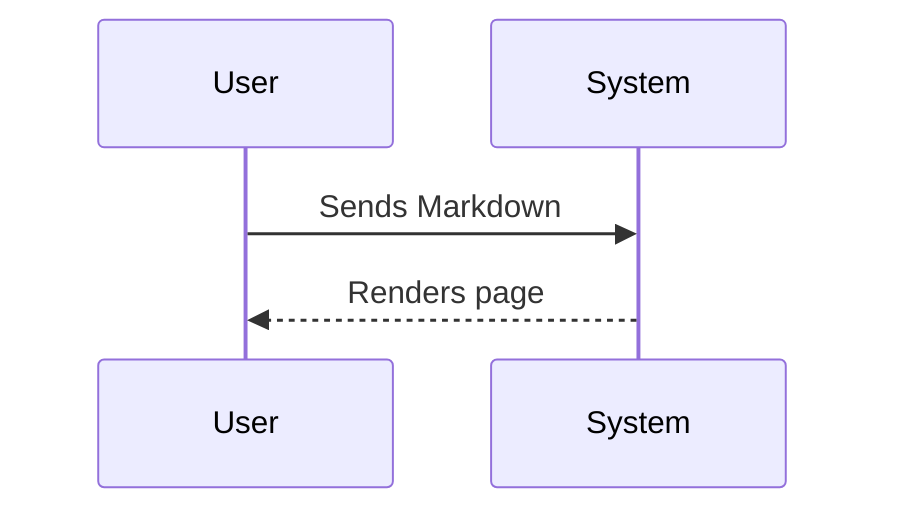

# Markup Reference

This page is a reference for contributors writing Flipper One documentation.
It covers both standard **Markdown** and **Archbee-specific syntax** supported by this wiki.

The source files live on GitHub at [**github.com/flipperdevices/flipper-one-docs**](https://github.com/flipperdevices/flipper-one-docs). Every merged pull request automatically rebuilds the live site. To contribute, fork the repo and open a pull request.

**Quick jump:**

- [**Headings**](./#headings)
- [**Text styles**](./#text-styles)
- [**Links**](./#links)
- [**Images**](./#images)
- [**Videos**](./#videos)
- [**Lists**](./#lists)
- [**Tables**](./#tables)
- [**Code**](./#code--syntax-highlighting)
- [**Callouts**](./#callouts)
- [**Math**](./#math)
- [**Mermaid diagrams**](./#mermaid-diagrams)
- [**Archbee components**](./#archbee-components)

***

## Headings

Flipper One documentation supports headings H1–H3. Use H1 for page-level sections, H2 for subsections, H3 for sub-subsections.

| Flipper One docs | Markdown |
| --- | --- |
| Heading H1 | `# Heading H1` |
| Heading H2 | `## Heading H2` |
| Heading H3 | `### Heading H3` |

***

## Text styles

| Flipper One docs | Markdown |
| --- | --- |
| Regular text | `Regular text` |
| **Bold** | `**Bold**` |
| *Italic* | `*Italic*` |
| ***Bold italic*** | `***Bold italic***` |
| ~~Strikethrough~~ | `~~Strikethrough~~` |
| `Inline code` | `` `Inline code` `` |
| $10^6$ and $H\_2O$ | `$10^6$` and `$H\_2O$` |

***

## Links

| Flipper One docs | Markdown |
| --- | --- |
| [**Archbee**](https://archbee.com) | `[**Archbee**](https://archbee.com)` |
| [https://example.com](https://example.com) | `[https://example.com](https://example.com)` |
| [Jump to Tables](./#tables) | `[Jump to Tables](./#tables)` |

***

## Images

Standard Markdown image with alt text and optional title:

| Flipper One docs | Markdown |
| --- | --- |
|  | `` |
|  | `` |

To **resize or align** an image, standard Markdown is not enough — use Archbee syntax:

`::Image[]{src="files/pics/test-image.jpg" size="40" position="flex-start" caption="Caption text"}`

| Attribute | Description |
| --- | --- |
| `src` | Path to the image (relative or absolute URL) |
| `size` | Width in pixels |
| `position` | Alignment: `flex-start` (left), `center`, `flex-end` (right) |
| `caption` | Optional caption shown below the image |

***

## Videos

To embed a YouTube video, use Archbee's embed syntax with the video URL:

`::embed[]{url="https://www.youtube.com/watch?v=VIDEO_ID"}`

***

## Lists

| Flipper One docs | Markdown |
| --- | --- |
| Unordered: `- Item A` / `- Nested A.1` / `- Item B` | `- Item A`<br />`  - Nested A.1`<br />`- Item B` |
| Ordered: `1. First` / `2. Second` / `3. Third` | `1. First`<br />`2. Second`<br />`3. Third` |

***

## Tables

Archbee supports two table formats.

**Standard Markdown pipe tables** — simple and readable, but no control over column widths or alignment:

```markdown
| Column 1 | Column 2 | Column 3 |
| --- | --- | --- |
| Cell | **Bold** | ✅ |
```

| Column 1 | Column 2 | Column 3 |
| --- | --- | --- |
| Cell | **Bold** | ✅ |

**HTML tables** — use when you need column widths, cell alignment, or images inside cells:

```html
<table isTableHeaderOn="true" columnWidths="220,440,220">
  <tr>
    <td><p>Header 1</p></td>
    <td><p>Header 2</p></td>
    <td align="center"><p>Header 3</p></td>
  </tr>
  <tr>
    <td><p>Cell</p></td>
    <td><p><strong>Bold cell</strong></p></td>
    <td align="center"><p>✅</p></td>
  </tr>
</table>
```

<table isTableHeaderOn="true" columnWidths="220,440,220">
  <tr>
    <td><p>Attribute</p></td>
    <td><p>Description</p></td>
    <td><p>Example</p></td>
  </tr>
  <tr>
    <td><p><code>isTableHeaderOn</code></p></td>
    <td><p>Renders the first row as a bold header</p></td>
    <td><p><code>"true"</code> / <code>"false"</code></p></td>
  </tr>
  <tr>
    <td><p><code>columnWidths</code></p></td>
    <td><p>Comma-separated pixel widths per column. Total should be ~880 px to fill the content area</p></td>
    <td><p><code>"220,440,220"</code></p></td>
  </tr>
  <tr>
    <td><p><code>align</code></p></td>
    <td><p>Horizontal alignment on a <code>&lt;td&gt;</code> element</p></td>
    <td><p><code>align="center"</code></p></td>
  </tr>
</table>

***

## Code & syntax highlighting

| Flipper One docs | Markdown |
| --- | --- |
| `const hi = "world";` | `` `const hi = "world";` `` |
| Fenced block with language | ` ```javascript ` / `// your code` / ` ``` ` |
| Diff block | ` ```diff ` / `+ Added line` / `- Removed line` / ` ``` ` |

Supported language tags: `javascript`, `typescript`, `python`, `bash`, `c`, `cpp`, `json`, `yaml`, `diff`, `tex`, `mermaid`.

***

## Callouts

Archbee supports four callout styles using `:::hint{type="..."}`:

:::hint{type="info"}
**info** — General information or context.

`:::hint{type="info"} ... :::`
:::

:::hint{type="success"}
**success** — Positive outcome or confirmation.

`:::hint{type="success"} ... :::`
:::

:::hint{type="warning"}
**warning** — Something to be careful about.

`:::hint{type="warning"} ... :::`
:::

:::hint{type="danger"}
**danger** — Risk of data loss or breaking change.

`:::hint{type="danger"} ... :::`
:::

***

## Math

| Flipper One docs | Markdown |
| --- | --- |
| $E=mc^2$ | `$E=mc^2$` |
| $\alpha + \beta = \gamma$ | `$\alpha + \beta = \gamma$` |
| Display math block | ` ```tex ` / `\int_{-\infty}^{\infty} e^{-x^2} dx = \sqrt{\pi}` / ` ``` ` |

```tex
\int_{-\infty}^{\infty} e^{-x^2} \, dx = \sqrt{\pi}
```

***

## Mermaid diagrams

Use a fenced `mermaid` block. Supported diagram types: `flowchart`, `sequenceDiagram`, `classDiagram`, `gantt`, and more.





***

## Archbee components

### Workflow steps

Use `WorkflowBlock` with `WorkflowBlockItem` for numbered step-by-step flows:

```markdown
::::WorkflowBlock
:::WorkflowBlockItem
Step one title

Step description.
:::

:::WorkflowBlockItem
Step two title

Step description.
:::
::::
```

::::WorkflowBlock
:::WorkflowBlockItem
Step one title

Step description.
:::

:::WorkflowBlockItem
Step two title

Step description.
:::
::::

***

### Two-column layout

Use `VerticalSplit` to place content side by side:

```markdown
::::VerticalSplit{layout="middle"}
:::VerticalSplitItem
**Left side**

Content
:::

:::VerticalSplitItem
**Right side**

Content
:::
::::
```

::::VerticalSplit{layout="middle"}
:::VerticalSplitItem
**Left side**

Content
:::

:::VerticalSplitItem
**Right side**

Content
:::
::::

***

### Expandable section

Use `ExpandableHeading` for collapsible content:

```markdown
:::ExpandableHeading
### Section title

Content shown when expanded.
:::
```

:::ExpandableHeading
### Section title

Content shown when expanded.
:::

***

## Image rendering tests

Testing how Archbee renders different combinations of image syntax for local vs remote images.

## Remote URL, no title


## Remote URL, with title


## Local path, no title


## Local path, with title


## Local path, Archbee syntax, position center

::Image[]{src="files/pics/test-image.jpg" size="400" position="center" caption="This is a caption"}

## Local path, Archbee syntax, position left

::Image[]{src="files/pics/test-image.jpg" size="400" position="flex-start" caption="This is a caption"}
