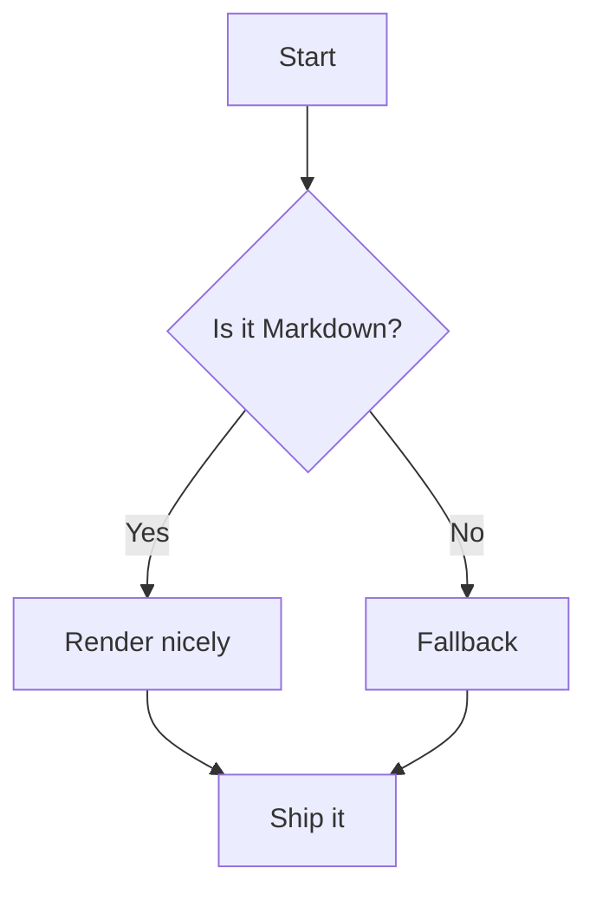
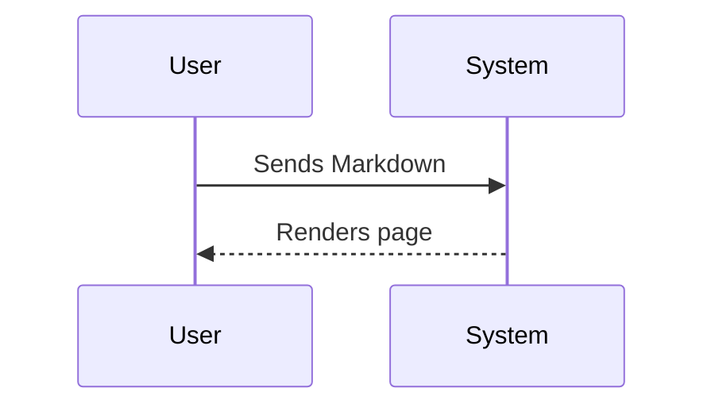

This page is a reference for contributors writing Flipper One documentation.
It covers both standard **Markdown** and **Archbee-specific syntax** supported by this wiki.

The source files live on GitHub at [github.com/flipperdevices/flipper-one-docs](https://github.com/flipperdevices/flipper-one-docs). Every merged pull request automatically rebuilds the live site. To contribute, fork the repo and open a pull request.

Quick jump:

- [Headings](#headings)
- [Text styles](#text-styles)
- [Links](#links)
- [Images](#images)
- [Videos](#videos)
- [Lists](#lists)
- [Tables](#tables)
- [Code](#code-syntax-highlighting)
- [Callouts](#callouts)
- [Math](#math)
- [Mermaid diagrams](#mermaid-diagrams)
- [Archbee components](#archbee-components)

***

## Headings

Flipper One documentation supports headings H1–H3.

:::hint{type="warning"}
**Don't add `# Heading 1` in the body.** Archbee renders the `title:` field from the YAML frontmatter as the page H1, so an extra `# H1` in the body produces two titles. Start body content at `## H2`.
:::

## ## Heading 2

### ### Heading 3

***

## Text styles

<table isTableHeaderOn="true" columnWidths="331,332">
  <tr>
    <td>
      <p><strong>Flipper One docs</strong></p>
    </td>
    <td>
      <p><strong>Markdown</strong></p>
    </td>
  </tr>
  <tr>
    <td>
      <p>Regular text</p>
    </td>
    <td>
      <p><code>Regular text</code></p>
    </td>
  </tr>
  <tr>
    <td>
      <p><strong>Bold</strong></p>
    </td>
    <td>
      <p><code>**Bold**</code></p>
    </td>
  </tr>
  <tr>
    <td>
      <p><em>Italic</em></p>
    </td>
    <td>
      <p><code>*Italic*</code></p>
    </td>
  </tr>
  <tr>
    <td>
      <p><em><strong>Bold italic</strong></em></p>
    </td>
    <td>
      <p><code>***Bold italic***</code></p>
    </td>
  </tr>
  <tr>
    <td>
      <p><del>Strikethrough</del></p>
    </td>
    <td>
      <p><code>~~Strikethrough~~</code></p>
    </td>
  </tr>
  <tr>
    <td>
      <p><code>Inline code</code></p>
    </td>
    <td>
      <p><code>`Inline code`</code></p>
    </td>
  </tr>
</table>

***

## Links

<table isTableHeaderOn="true" columnWidths="331,332">
  <tr>
    <td>
      <p><strong>Flipper One docs</strong></p>
    </td>
    <td>
      <p><strong>Markdown</strong></p>
    </td>
  </tr>
  <tr>
    <td>
      <p><a href="https://archbee.com">Archbee</a></p>
    </td>
    <td>
      <p><code>[Archbee](https://archbee.com)</code></p>
    </td>
  </tr>
  <tr>
    <td>
      <p><a href="https://example.com">https://example.com</a></p>
    </td>
    <td>
      <p><code>[https://example.com](https://example.com)</code></p>
    </td>
  </tr>
  <tr>
    <td>
      <p><a href="Markup-reference.md">Jump to Tables</a></p>
    </td>
    <td>
      <p><code>[Jump to Tables](./#tables)</code></p>
    </td>
  </tr>
</table>

‎&#x20;

To control whether a link opens in a new tab — and to write short relative hrefs for in-docs links — use Archbee's `:Link[]` directive instead of plain Markdown.

External link (new tab):
```markdown
:Link[label]{href="https://example.com" newTab="true" hasDisabledNofollow="false"}
```

Same-page anchor (same tab):

```markdown
:Link[label]{href="./#section-name" newTab="false" hasDisabledNofollow="true"}
```

Another page in the docs (optional anchor):

```markdown
:Link[label]{href="<relative-path>.md#section-name" newTab="true" hasDisabledNofollow="true"}
```

Use a path relative to the current file:

- `./Other-Page.md` — file in the same folder
- `./folder/Other-Page.md` — file in a subfolder
- `../folder/Other-Page.md` — file in a sibling folder

The `#section-name` anchor is optional. Anchor IDs are derived from the heading text (lowercased, spaces replaced with hyphens).

<table isTableHeaderOn="true" columnWidths="141,522">
  <tr>
    <td>
      <p><strong>Attribute</strong></p>
    </td>
    <td>
      <p><strong>Description</strong></p>
    </td>
  </tr>
  <tr>
    <td>
      <p><code>href</code></p>
    </td>
    <td>
      <p>Link target. Supports full URLs (<code>https://example.com</code>), same-page anchors (<code>./#section</code>), and relative paths to other docs pages (<code>./Other-Page.md</code>, <code>./folder/Other-Page.md</code>, <code>../folder/Other-Page.md</code>). Append <code>#section</code> to jump to a specific heading.</p>
    </td>
  </tr>
  <tr>
    <td>
      <p><code>newTab</code></p>
    </td>
    <td>
      <p><code>"true"</code> opens the link in a new tab, <code>"false"</code> opens it in the same tab. Use <code>"false"</code> for same-page anchor links.</p>
    </td>
  </tr>
  <tr>
    <td>
      <p><code>hasDisabledNofollow</code></p>
    </td>
    <td>
      <p><code>"false"</code> adds <code>rel="nofollow"</code> to the link (default for external links); <code>"true"</code> removes it.</p>
    </td>
  </tr>
</table>

***

## Images

**Remote URL:** ``


‎&#x20;

**Local path:** ``


​
‎&#x20;

To **resize or align** an image, standard Markdown is not enough — use Archbee syntax:

`::Image[]{src="/files/pics/test-image.jpg" size="40" position="flex-start" caption="Caption text"}`

::Image[]{src="https://api.archbee.com/api/optimize/3StCFqarJkJQZV-7N79yY/sDIW27SOFL0HZKEvDEU_T-20260420-092354.png" size="40" width="1950" height="1200" position="flex-start" caption="Caption text"}

<table isTableHeaderOn="true" columnWidths="141,522">
  <tr>
    <td>
      <p><strong>Attribute</strong></p>
    </td>
    <td>
      <p><strong>Description</strong></p>
    </td>
  </tr>
  <tr>
    <td>
      <p><code>src</code></p>
    </td>
    <td>
      <p>Path to the image (relative or absolute URL).</p>
    </td>
  </tr>
  <tr>
    <td>
      <p><code>size</code></p>
    </td>
    <td>
      <p>Width value in percent.</p>
    </td>
  </tr>
  <tr>
    <td>
      <p><code>position</code></p>
    </td>
    <td>
      <p>Page alignment when the image is smaller than the content area: <code>flex-start</code> (left), <code>center</code>, <code>flex-end</code> (right). Has no effect on caption alignment.</p>
    </td>
  </tr>
  <tr>
    <td>
      <p><code>caption</code></p>
    </td>
    <td>
      <p>An optional caption is shown below the image. Always left-aligned for local images.</p>
    </td>
  </tr>
</table>

‎&#x20;

### Inline images

You can add inline images using `inlineImage`:

```markdown
:inlineImage[]{src="/files/icons/ptt-button-light.png"}
```

This is how an inline image :inlineImage[]{src="/files/icons/ptt-button-light.png"} appears in a paragraph.

***

Use the following icons for Flipper One controls:

* :inlineImage[]{src="/files/icons/ptt-button-light.png"} PTT light button (`ptt-button-light.png`)
* :inlineImage[]{src="/files/icons/ptt-button-orange.png"} PTT orange button (`ptt-button-orange.png`)
* :inlineImage[]{src="/files/icons/touchpad.png"} Touchpad (`touchpad.png`)
* :inlineImage[]{src="/files/icons/touchpad-left-right.png"} Touchpad left-right movement (`touchpad-left-right.png`)
* :inlineImage[]{src="/files/icons/touchpad-up-down.png"} Touchpad up-down movement (`touchpad-up-down.png`)
* :inlineImage[]{src="/files/icons/touchpad-four-way-movement.png"} Touchpad four-way movement (`touchpad-four-way-movement.png`)
* :inlineImage[]{src="/files/icons/esc-button.png"} Esc button (`esc-button.png`)
* :inlineImage[]{src="/files/icons/view-button.png"} View button (`rview-button.png`)
* :inlineImage[]{src="/files/icons/power-button-led-off.png"} Power button with LED off (`power-button-led-off.png`)
* :inlineImage[]{src="/files/icons/power-button-led-green.png"} Power button with green LED (`power-button-led-green.png`)
* :inlineImage[]{src="/files/icons/power-button-led-yellow.png"} Power button with yellow LED (`power-button-led-yellow.png`)
* :inlineImage[]{src="/files/icons/edit-button.png"} Edit button (`edit-button.png`)
* :inlineImage[]{src="/files/icons/run-button.png"} Run button (`run-button.png`)
* :inlineImage[]{src="/files/icons/app-switcher-button.png"} App switcher button (`app-switcher-button.png`)
* :inlineImage[]{src="/files/icons/back-button-light.png"} Back light button (`back-button-light.png`)
* :inlineImage[]{src="/files/icons/back-button-orange.png"} Back orange button (`back-button-orange.png`)
* :inlineImage[]{src="/files/icons/dpad-ok-button.png"} Ok button on the D-pad (`dpad-ok-button.png`)
* :inlineImage[]{src="/files/icons/dpad-down-button.png"} Down button on the D-pad (`dpad-down-button.png`)
* :inlineImage[]{src="/files/icons/dpad-left-button.png"} Left button on the D-pad (`dpad-left-button.png`)
* :inlineImage[]{src="/files/icons/dpad-up-button.png"} Up button on the D-pad (`dpad-up-button.png`)
* :inlineImage[]{src="/files/icons/dpad-right-button.png"} Right button on the D-pad (`dpad-right-button.png`)
* :inlineImage[]{src="/files/icons/dpad-left-right-button.png"} Right or Left buttons on the D-pad (`dpad-left-right-button.png`)
* :inlineImage[]{src="/files/icons/dpad-up-down-button.png"} Up or Down buttons on the D-pad (`dpad-up-down-button.png`)

***

## Videos

Two methods to embed video are supported.

**Method 1: YouTube** — use Archbee's embed syntax:

`::embed[]{url="https://www.youtube.com/watch?v=VIDEO_ID"}`

::embed[]{url="https://www.youtube.com/watch?v=dQw4w9WgXcQ"}

​

**Method 2: Self-hosted / CDN video** — use the Archbee `:::Iframe` component. The HTML you embed goes inside the `code="..."` attribute, which means **every `"` must be escaped as `&#x22;` and every newline as `&#xA;`**. The whole HTML ends up on one logical line:

```text
:::Iframe{code="<video&#xA;    autoplay muted loop playsinline style=&#x22;width: 100%; margin: 0 !important;&#x22;&#xA;    src=&#x22;https://cdn.example.com/your-video.mp4&#x22;&#xA;></video>&#xA;<div class=&#x22;text-center mt-2.5 text-gray-400 pb-5&#x22;>&#xA;Caption&#xA;</div>" iframeHeight="500"}

:::
```

Conceptually that decodes to:

```html
<video
    autoplay muted loop playsinline style="width: 100%; margin: 0 !important;"
    src="https://cdn.example.com/your-video.mp4"
></video>
<div class="text-center mt-2.5 text-gray-400 pb-5">
Caption
</div>
```

:::Iframe{code="<video&#xA;    autoplay muted loop playsinline style=&#x22;width: 100%; margin: 0 !important;&#x22;&#xA;    src=&#x22;https://cdn.flipperzero.one/Pan_rotate_and_move_parts_compressed.mp4&#x22;&#xA;></video>&#xA;<div class=&#x22;text-center mt-2.5 text-gray-400 pb-5&#x22;>&#xA;Caption&#xA;</div>" iframeHeight="500"}

:::

***

## Lists

<table isTableHeaderOn="true" columnWidths="330,330">
  <tr>
    <td>
      <p><strong>Flipper One docs</strong></p>
    </td>
    <td>
      <p><strong>Markdown</strong></p>
    </td>
  </tr>
  <tr>
    <td>
      <ul>
        <li>Item A</li>
        <li>Item B</li>
      </ul>
    </td>
    <td>
      <p><code>- Item A</code></p>
      <p><code>- Item B</code></p>
    </td>
  </tr>
  <tr>
    <td>
      <ol>
      <li>First</li>
      <li>Second</li>
      <li>Third</li>
      </ol>
    </td>
    <td>
      <p><code>1. First</code></p>
      <p><code>2. Second</code></p>
      <p><code>3. Third</code></p>
    </td>
  </tr>
</table>

***

## Divider

Use `***` or `---` to insert a horizontal divider.

***

## Tables

Archbee supports two table formats.

**Standard Markdown pipe tables** — simple and readable, but no control over column widths or alignment:

```markdown
| Column 1 | Column 2 | Column 3 |
| --- | --- | --- |
| Cell | **Bold** | ✅ |
```

<table isTableHeaderOn="true" columnWidths="221,221,221">
  <tr>
    <td>
      <p><strong>Column 1</strong></p>
    </td>
    <td>
      <p><strong>Column 2</strong></p>
    </td>
    <td>
      <p><strong>Column 3</strong></p>
    </td>
  </tr>
  <tr>
    <td>
      <p>Cell</p>
    </td>
    <td>
      <p><strong>Bold</strong></p>
    </td>
    <td>
      <p>✅</p>
    </td>
  </tr>
</table>

​ 

**HTML tables** — use when you need column widths, cell alignment, or images inside cells:

```html
<table isTableHeaderOn="true" columnWidths="165,330,165">
  <tr>
    <td><p>Header 1</p></td>
    <td><p>Header 2</p></td>
    <td align="center"><p>Header 3</p></td>
  </tr>
  <tr>
    <td><p>Cell</p></td>
    <td><p><strong>Bold cell</strong></p></td>
    <td align="center"><p>✅</p></td>
  </tr>
</table>
```

<table isTableHeaderOn="true" columnWidths="165,330,165">
  <tr>
    <td>
      <p><strong>Attribute</strong></p>
    </td>
    <td>
      <p><strong>Description</strong></p>
    </td>
    <td>
      <p><strong>Example</strong></p>
    </td>
  </tr>
  <tr>
    <td>
      <p><code>isTableHeaderOn</code></p>
    </td>
    <td>
      <p>Renders the first row as a bold header</p>
    </td>
    <td>
      <p><code>"true"</code> / <code>"false"</code></p>
    </td>
  </tr>
  <tr>
    <td>
      <p><code>columnWidths</code></p>
    </td>
    <td>
      <p>Comma-separated pixel widths per column. Total must not exceed 660 px</p>
    </td>
    <td>
      <p><code>"165,330,165"</code></p>
    </td>
  </tr>
  <tr>
    <td>
      <p><code>align</code></p>
    </td>
    <td>
      <p>Horizontal alignment on a <code>&#x3C;td></code> element</p>
    </td>
    <td>
      <p><code>align="center"</code></p>
    </td>
  </tr>
</table>

***

## Code & syntax highlighting

Fenced block with language:

````markdown
```javascript
function greet(name) {
  return `Hello, ${name}!`;
}
```
````

```javascript
function greet(name) {
  return `Hello, ${name}!`;
}
```

​

Diff block:

````markdown
```diff
+ Added line
- Removed line
```
````

```diff
+ Added line
- Removed line
```

Supported language tags: `markdown`, `html`, `javascript`, `typescript`, `python`, `bash`, `c`, `cpp`, `json`, `yaml`, `diff`, `tex`, `mermaid`, and more.

***

## Callouts

Archbee supports four callout styles using `:::hint{type="..."}`:

```markdown
:::hint{type="info"}
Your text for the **info callout** here
:::
```

:::hint{type="info"}
Your text for the **info callout** here
:::

‎&#x20;

```markdown
:::hint{type="success"}
Your text for the **success callout** here
:::
```

:::hint{type="success"}
Your text for the **success callout** here
:::

‎&#x20;

```markdown
:::hint{type="warning"}
Your text for the **warning callout** here
:::
```

:::hint{type="warning"}
Your text for the **warning callout** here
:::

‎&#x20;

```markdown
:::hint{type="danger"}
Your text for the **danger callout** here
:::
```

:::hint{type="danger"}
Your text for the **danger callout** here
:::

***

## Math

Archbee only supports math via a fenced `tex` block. Inline math (`$...$`) is **not supported**.

````markdown
```tex
\int_{-\infty}^{\infty} e^{-x^2} \, dx = \sqrt{\pi}
```
````

```tex
\int_{-\infty}^{\infty} e^{-x^2} \, dx = \sqrt{\pi}
```

***

## Mermaid diagrams

Use a fenced `mermaid` block. Supported diagram types: `flowchart`, `sequenceDiagram`, `classDiagram`, `gantt`, and more.

```none
flowchart TD
  A[Start] --> B{Is it Markdown?}
  B -- Yes --> C[Render nicely]
  B -- No  --> D[Fallback]
  C --> E[Ship it]
  D --> E
```



​

```none
sequenceDiagram
  participant U as User
  participant S as System
  U->>S: Sends Markdown
  S-->>U: Renders page
```



***

## Archbee components

### Workflow steps

Use `WorkflowBlock` with `WorkflowBlockItem` for numbered step-by-step flows:

```markdown
::::WorkflowBlock
:::WorkflowBlockItem
Step one title

Step description.
:::

:::WorkflowBlockItem
Step two title

Step description.
:::
::::
```

::::WorkflowBlock
:::WorkflowBlockItem
Step one title

Step description.
:::

:::WorkflowBlockItem
Step two title

Step description.
:::
::::

***

### Two-column layout

Use `VerticalSplit` to place content side by side:

```markdown
::::VerticalSplit{layout="middle"}
:::VerticalSplitItem
**Left side**

Content
:::

:::VerticalSplitItem
**Right side**

Content
:::
::::
```

::::VerticalSplit{layout="middle"}
:::VerticalSplitItem
**Left side**

Content
:::

:::VerticalSplitItem
**Right side**

Content
:::
::::

***

### Expandable section

Use `ExpandableHeading` for collapsible content:

```markdown
:::ExpandableHeading
### Section title

Content shown when expanded.
:::
```

:::ExpandableHeading
### Section title

Content shown when expanded.
:::

