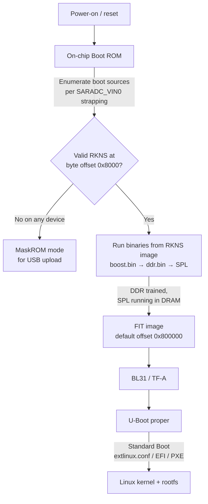

This page describes the cold-boot sequence of the Rockchip RK3576 SoC used in Flipper One: from the on-chip Boot ROM through DDR initialization, SPL, the FIT-packaged main bootloader (U-Boot + ARM Trusted Firmware-A), and finally the operating system. It also documents the on-flash layout that the Boot ROM and SPL rely on.

The legacy [Rockchip Boot option wiki](https://opensource.rock-chips.com/wiki_Boot_option) covers older SoCs (RK33xx and earlier) and uses obsolete terminology (`miniloader`, `idbloader`) that is **not** part of the current RK3576 stack.

***

## Boot sequence

The RK3576 boot chain is built from several stages. Each stage has a narrow responsibility and prepares the system for the next one.

***

### Stage 1: On-chip Boot ROM

The Boot ROM is mask-programmed silicon that cannot be modified. It begins executing as soon as power is applied to the RK3576. It is responsible for:

1. Reading the voltage on the `SARADC_VIN0_BOOT` strapping pin to determine the boot priority list. Typical orderings are `eMMC → SD → MaskROM` or `UFS → SD → MaskROM`, depending on the board design.
2. Walking the boot-source list and, for each device, looking for a valid RKNS image signature at byte offset `0x8000`.
3. Entering **MaskROM mode** if no bootable device is found. It allows access to the boot storages via USB.

:::hint{type="info"}
For details on using MaskROM mode and available boot priority lists, see [Rockchip MaskROM mode](/cpu-software/How-to-install-linux-image.md#rockchip-maskrom-mode).
:::

***

### Stage 2: Early bootloader (RKNS image)

The RKNS (Rockchip Boot Image) container includes a set of binaries that are loaded into on-chip SRAM by the Boot ROM and executed sequentially, normally returning control to the Boot ROM after each stage until the SPL locates the main bootloader image and jumps to it.

Binaries included in the RKNS image:

<table isTableHeaderOn="true" columnWidths="180,480">
  <tr>
    <td>
<strong>Binary</strong>
</td>
    <td>
<strong>Purpose</strong>
</td>
  </tr>
  <tr>
    <td>
<code>boost.bin</code>
</td>
    <td>
Patches parts of the Boot ROM code already loaded into SRAM and configures power-mode parameters for UFS flash. Optional on boards that do not boot from UFS.
</td>
  </tr>
  <tr>
    <td>
<code>ddr.bin</code>
</td>
    <td>
Initializes the DDR memory controller and runs <em>RAM training</em> (timing calibration). After this stage, DRAM is usable.
</td>
  </tr>
  <tr>
    <td>
<code>SPL</code>
</td>
    <td>
U-Boot Secondary Program Loader. Runs from DRAM, re-discovers the boot device to load the main bootloader's FIT image from.
</td>
  </tr>
</table>

:::hint{type="warning"}
On RK3576 the `ddr.bin` produced by Rockchip is a closed-source binary blob — there is currently no open-source replacement. This is tracked in [flipperone-linux-build-scripts#56](https://github.com/flipperdevices/flipperone-linux-build-scripts/issues/56).
:::

***

### Stage 3: Main bootloader (FIT image)

Once SPL is running in DRAM, it loads the **main bootloader FIT image** from a fixed offset on the boot device. The default byte offset is 0x800000. The exact offset is hard-coded in the SPL build configuration and can be changed at compile time.

The FIT image is a Flattened Image Tree container (`u-boot.itb`) that may include any combination of:

<table isTableHeaderOn="true" columnWidths="180,480">
  <tr>
    <td>
<strong>Component</strong>
</td>
    <td>
<strong>Role</strong>
</td>
  </tr>
  <tr>
    <td>
<strong>DTB</strong>
</td>
    <td>
Device tree blob describing on-board peripherals to U-Boot and (later) Linux.
</td>
  </tr>
  <tr>
    <td>
<strong>BL31</strong>
</td>
    <td>
Part of ARM Trusted Firmware-A. It runs at <a href="https://developer.arm.com/documentation/102412/0103/Privilege-and-Exception-levels/Exception-levels">EL3</a> and provides secure monitor functionality and EL3 runtime services. BL31 handles operations such as CPU power-state transitions, PSCI services, suspend/resume support, and other platform-specific secure monitor calls issued by software running in the non-secure OS.
</td>
  </tr>
  <tr>
    <td>
<strong>BL32</strong>
</td>
    <td>
Optional Trusted Execution Environment (OP-TEE). Used when the platform requires a secure OS for trusted applications. Tracked for RK3576 in <a href="https://github.com/flipperdevices/flipperone-linux-build-scripts/issues/57">flipperone-linux-build-scripts#57</a>.
</td>
  </tr>
  <tr>
    <td>
<strong>U-Boot proper</strong>
</td>
    <td>
The main bootloader binary that runs after BL31 hands off control. Runs at <a href="https://developer.arm.com/documentation/102412/0103/Privilege-and-Exception-levels/Exception-levels">EL2</a>.
</td>
  </tr>
</table>

The FIT image also includes a configuration node, that determines which images where must be loaded and in what order. In a normal boot BL31 runs first and takes care of further steps.

***

### Stage 4: U-Boot proper

U-Boot is feature-rich enough to load almost anything from almost anywhere, so the flow becomes board- and image-specific from this point on.

**Rockchip vendor U-Boot** (based on a 2017 codebase) boots via hard-coded commands. Used in Rockchip's BSP / SDK images.

**Current mainline U-Boot** uses Standard Boot, which enumerates the available storage devices, looks for "bootable" partitions on each, and for each partition considers a variety of boot methods such as `extlinux.conf`, plain EFI bootable binaries, PXElinux boot scripts etc.

Current Flipper test images use `extlinux.conf`, but that may change in the future.

***

## Flash layout

Only two on-flash offsets are fixed by the boot chain; everything else is determined by the partition table and the SPL build configuration.

<table isTableHeaderOn="true" columnWidths="220,140,300">
  <tr>
    <td>
<strong>Region</strong>
</td>
    <td>
<strong>Byte offset</strong>
</td>
    <td>
<strong>Notes</strong>
</td>
  </tr>
  <tr>
    <td>
Early bootloader (RKNS image)
</td>
    <td>
0x8000
</td>
    <td>
Sector <strong>64</strong> on 512-byte-sector media (SD, eMMC); sector <strong>8</strong> on 4096-byte-sector media (UFS). Searched by Boot ROM.
</td>
  </tr>
  <tr>
    <td>
Main bootloader (FIT image)
</td>
    <td>
0x800000 (default)
</td>
    <td>
Loaded by SPL. The actual offset is set in the SPL build config and can be changed.
</td>
  </tr>
  <tr>
    <td>
Partition table (GPT or Rockchip parameter)
</td>
    <td>
Varies
</td>
    <td>
Read by U-Boot proper; not consulted by Boot ROM or SPL.
</td>
  </tr>
  <tr>
    <td>
Bootable partition(s) — kernel, rootfs, <code>extlinux.conf</code>, EFI binaries, …
</td>
    <td>
Per partition table
</td>
    <td>
Discovered by U-Boot Standard Boot.
</td>
  </tr>
</table>

:::hint{type="info"}
**Modern packaging.** Upstream U-Boot produces a single combined bootloader image, `u-boot-rockchip.bin`, in which the RKNS part and the FIT part are already placed at the correct offsets with the necessary padding between them, so for most users the particular structure of those images shouldn't matter much.
:::

:::hint{type="danger"}
The combined image is normally written with `dd`, e.g. `dd if=u-boot-rockchip.bin of=/dev/<target> bs=512 seek=64 conv=fsync`. **Verify the target device with `lsblk` before running** — `dd` overwrites the target unconditionally, and pointing it at the wrong disk will destroy data on the host system.
:::

***

## References

- Comment by alchark in the flipperone-docs#52 issue: https://github.com/flipperdevices/flipperone-docs/issues/52#issuecomment-4509109037
- U-Boot Rockchip documentation: https://docs.u-boot.org/en/latest/board/rockchip/rockchip.html
- U-Boot Rockchip README in the official repo: https://github.com/u-boot/u-boot/blob/master/doc/README.rockchip
- Firmware design documentation in ARM Trusted Firmware-A: https://trustedfirmware-a.readthedocs.io/en/latest/design/firmware-design.html
