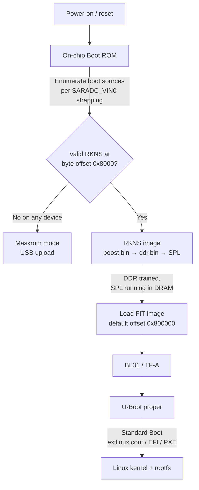

This page describes the cold-boot sequence of the Rockchip RK3576 SoC used in Flipper One: from the on-chip Boot ROM through DDR initialization, SPL, the FIT-packaged main bootloader (U-Boot + ARM Trusted Firmware), and finally the operating system. It also documents the on-flash layout that the Boot ROM and SPL rely on.

The legacy [Rockchip Boot option wiki](https://opensource.rock-chips.com/wiki_Boot_option) covers older SoCs (RK33xx and earlier) and uses obsolete terminology (`miniloader`, `idbloader`) that is **not** part of the current RK3576 stack.

***

## Overview

***

## Stage 1 — On-chip Boot ROM

The Boot ROM is mask-programmed silicon that runs the moment power is applied to the RK3576. It is responsible for:

1. Reading the **`SARADC_VIN0`** strapping pin to determine the priority order of boot sources. Typical orderings are `eMMC → SD → Maskrom` or `UFS → SD → Maskrom`, depending on the board design.
2. Walking the boot-source list and, for each device, looking for a valid **RKNS** image signature at **byte offset `0x8000`**.
3. Falling back to **Maskrom mode** (USB upload from a host PC) if no bootable device is found.

:::hint{type="info"}
The `SARADC_VIN0` pin samples an analog voltage divider on the board; the divider ratio encodes the boot-priority configuration. See the RK3576 TRM, chapter *Boot configuration*, for the full table of recognized voltage ranges.
:::

For details on entering and using Maskrom mode, see :Link[Rockchip RK3576 — Maskrom]{href="./Rockchip-RK3576.md#maskrom" newTab="false" hasDisabledNofollow="true"}.

***

## Stage 2 — RKNS image (early bootloaders)

The RKNS (Rockchip Boot Image) container is loaded by the Boot ROM into on-chip SRAM and executed in place. On older Rockchip SoCs this stage was split between a TPL (DDR init) and an SPL (bootloader hand-off); on RK3576 the equivalent functionality is delivered as a small set of binaries bundled into one RKNS image, executed in order:

<table isTableHeaderOn="true" columnWidths="180,480">
  <tr>
    <td>
<strong>Binary</strong>
</td>
    <td>
<strong>Purpose</strong>
</td>
  </tr>
  <tr>
    <td>
<code>boost.bin</code>
</td>
    <td>
Patches parts of the Boot ROM code already loaded in SRAM and configures power-mode parameters for UFS flash. Optional on boards that do not boot from UFS.
</td>
  </tr>
  <tr>
    <td>
<code>ddr.bin</code>
</td>
    <td>
Initializes the DDR memory controller and runs RAM <em>training</em> (timing calibration). After this stage DRAM is usable.
</td>
  </tr>
  <tr>
    <td>
<code>SPL</code>
</td>
    <td>
U-Boot Secondary Program Loader. Runs from DRAM, re-discovers the boot device, and loads the FIT-packaged main bootloader.
</td>
  </tr>
</table>

:::hint{type="warning"}
On RK3576 the `ddr.bin` produced by Rockchip is a closed-source binary blob — there is currently no open-source replacement. This is tracked in :Link[flipperone-linux-build-scripts#56]{href="https://github.com/flipperdevices/flipperone-linux-build-scripts/issues/56" newTab="true" hasDisabledNofollow="false"}.
:::

***

## Stage 3 — FIT image (main bootloader)

Once SPL is running in DRAM it loads the **main bootloader FIT image** from a fixed offset on the boot device — by default **byte offset `0x800000`**. The exact offset is hard-coded in the SPL build configuration and can be changed at compile time.

The FIT image is a Flattened Image Tree container (`u-boot.itb`) that may include any combination of:

<table isTableHeaderOn="true" columnWidths="180,480">
  <tr>
    <td>
<strong>Component</strong>
</td>
    <td>
<strong>Role</strong>
</td>
  </tr>
  <tr>
    <td>
<strong>DTB</strong>
</td>
    <td>
Device tree blob describing on-board peripherals to U-Boot and (later) Linux.
</td>
  </tr>
  <tr>
    <td>
<strong>U-Boot proper</strong>
</td>
    <td>
The main bootloader binary that runs after BL31 hands off control.
</td>
  </tr>
  <tr>
    <td>
<strong>BL31</strong>
</td>
    <td>
ARM Trusted Firmware-A — the EL3 secure monitor. Mandatory on ARMv8.
</td>
  </tr>
  <tr>
    <td>
<strong>BL32</strong>
</td>
    <td>
Optional TEE OS (OP-TEE). Tracked for RK3576 in :Link[flipperone-linux-build-scripts#57]{href="https://github.com/flipperdevices/flipperone-linux-build-scripts/issues/57" newTab="true" hasDisabledNofollow="false"}.
</td>
  </tr>
</table>

The FIT *configuration* node decides which images are loaded and in what order. In a normal boot **BL31 runs first**; it then drops to EL2 and starts U-Boot proper.

***

## Stage 4 — U-Boot proper

U-Boot is feature-rich enough to load almost anything from almost anywhere, so the flow becomes board- and image-specific from this point on.

<table isTableHeaderOn="true" columnWidths="220,440">
  <tr>
    <td>
<strong>U-Boot flavour</strong>
</td>
    <td>
<strong>Boot behaviour</strong>
</td>
  </tr>
  <tr>
    <td>
Rockchip vendor U-Boot (~2017 base)
</td>
    <td>
Boots via hard-coded commands defined at build time. Used in Rockchip's BSP / SDK images.
</td>
  </tr>
  <tr>
    <td>
Mainline U-Boot (Flipper One)
</td>
    <td>
Uses <strong>Standard Boot</strong>: enumerates available storage, scans each for bootable partitions, and tries multiple boot methods per partition (<code>extlinux.conf</code>, plain EFI binaries, PXElinux scripts, …).
</td>
  </tr>
</table>

Current Flipper One test images boot through **`extlinux.conf`**, but this may change.

***

## Flash structure

Only two on-flash offsets are fixed by the boot chain — everything else is determined by the partition table and the SPL build configuration.

<table isTableHeaderOn="true" columnWidths="220,140,300">
  <tr>
    <td>
<strong>Region</strong>
</td>
    <td>
<strong>Byte offset</strong>
</td>
    <td>
<strong>Notes</strong>
</td>
  </tr>
  <tr>
    <td>
RKNS image (TPL + SPL)
</td>
    <td>
<code>0x8000</code>
</td>
    <td>
Sector <strong>64</strong> on 512-byte-sector media (SD, eMMC); sector <strong>8</strong> on 4096-byte-sector media (UFS). Searched by Boot ROM.
</td>
  </tr>
  <tr>
    <td>
FIT image (U-Boot proper + BL31 [+ BL32] + DTB)
</td>
    <td>
<code>0x800000</code> (default)
</td>
    <td>
Loaded by SPL. The actual offset is set in the SPL build config and can be moved.
</td>
  </tr>
  <tr>
    <td>
Partition table (GPT or Rockchip parameter)
</td>
    <td>
varies
</td>
    <td>
Read by U-Boot proper; not consulted by Boot ROM or SPL.
</td>
  </tr>
  <tr>
    <td>
Bootable partition(s) — kernel, rootfs, <code>extlinux.conf</code>, EFI binaries, …
</td>
    <td>
per partition table
</td>
    <td>
Discovered by U-Boot Standard Boot.
</td>
  </tr>
</table>

:::hint{type="info"}
**Modern packaging.** Upstream U-Boot now produces a single combined image, `u-boot-rockchip.bin`, in which the RKNS part and the FIT part are already placed at the correct offsets with the required padding between them. Writing this one file to the start of the boot device takes care of both pieces, so the on-disk layout of the individual sub-images rarely needs to be touched by hand.
:::

:::hint{type="danger"}
The combined image is normally written with `dd`, e.g. `dd if=u-boot-rockchip.bin of=/dev/<target> bs=512 seek=64 conv=fsync`. **Verify the target device with `lsblk` before running** — `dd` overwrites the target unconditionally, and pointing it at the wrong disk will destroy data on the host system.
:::

***

## References

- alchark, [comment on flipperone-docs#52](https://github.com/flipperdevices/flipperone-docs/issues/52#issuecomment-4509109037) — primary source for the boot flow and flash offsets documented here.
- Rockchip, *RK3576 Technical Reference Manual* — chapter *Boot configuration* covers `SARADC_VIN0` strapping and the RKNS signature.
- Mainline U-Boot, [`doc/board/rockchip/rockchip.rst`](https://docs.u-boot.org/en/latest/board/rockchip/rockchip.html) — documents `u-boot-rockchip.bin` packaging and Standard Boot.
- ARM Trusted Firmware-A documentation, [TF-A boot flow](https://trustedfirmware-a.readthedocs.io/en/latest/design/firmware-design.html#cold-boot).
