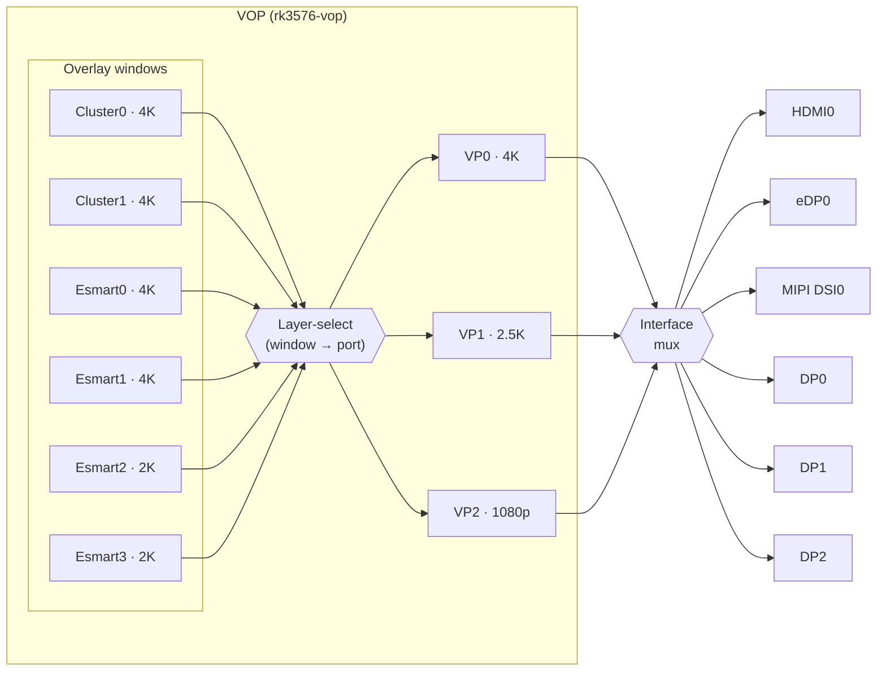

This page describes the display pipeline of the Rockchip RK3576 SoC used in Flipper One:

- Video Output Processor (VOP)
- Video Ports (VP0, VP1, VP2)
- Display interfaces each port can drive
- How to reroute an interface to a different port at the device-tree level

:::hint{type="warning"}
RK3576 has a **single** VOP IP instance: `compatible = "rockchip,rk3576-vop"`, handled by the mainline `vop2` driver. (Although earlier Rockchip reference and some issue titles refer to *VOP1* / *VOP2* as separate blocks.) "VOP2" is the driver family, *not* a second controller. The three independent display pipelines are **Video Ports**, not separate VOPs.
:::

***

## Architecture overview

The VOP is one hardware block at `0x27d00000`. It composes several overlay windows into up to three independent display streams, one per Video Port. Each Video Port has its own pixel clock (`DCLK_VP0/1/2`) and its own interrupt, and is steered to a physical display interface (HDMI, eDP, MIPI DSI, DisplayPort) through an interface multiplexer.



***

## Video ports

Each Video Port is a fixed display controller with its own maximum timing. Windows are assigned to a port by the overlay layer-select logic; the port is then connected to exactly one active interface at a time.

<table isTableHeaderOn="true" columnWidths="110,150,110,290">
  <tr>
    <td><p><strong>Video Port</strong></p></td>
    <td><p><strong>Max resolution</strong></p></td>
    <td><p><strong>Max refresh</strong></p></td>
    <td><p><strong>Can drive</strong></p></td>
  </tr>
  <tr>
    <td><p><strong>VP0</strong></p></td>
    <td><p>4096x2160</p></td>
    <td><p>120 Hz</p></td>
    <td><p>HDMI0, eDP0, MIPI DSI0, DP0</p></td>
  </tr>
  <tr>
    <td><p><strong>VP1</strong></p></td>
    <td><p>2560x1600</p></td>
    <td><p>60 Hz</p></td>
    <td><p>HDMI0, eDP0, MIPI DSI0, DP0, DP1</p></td>
  </tr>
  <tr>
    <td><p><strong>VP2</strong></p></td>
    <td><p>1920x1080</p></td>
    <td><p>60 Hz</p></td>
    <td><p>HDMI0, MIPI DSI0, DP1, DP2</p></td>
  </tr>
</table>

4K@120 on VP0 is reachable over HDMI 2.1 **or** DisplayPort; eDP0 cannot drive it.

The interface a port drives is selected in hardware by the `RK3576_DSP_IF_MUX` field inside the per-interface `RK3576_DSP_IF_CTRL` registers (HDMI0 at `0x184`, eDP0 at `0x188`, DP0 at `0x18C`, DP1 at `0x1A4`). The mux field holds the VP ID, so each interface is pointed at the port that should feed it. The mainline driver programs these from the device-tree routing described below — you do not write them by hand.

***

## Routing interfaces to ports (device tree)

In mainline `rk3576.dtsi` the VOP `vp0`/`vp1`/`vp2` ports are declared **empty** — unlike rk3588, no `*_in_vpN` endpoints are pre-defined. A routing is a pair of `of_graph` endpoints you add in the board DTS: one in the interface's `*_in` port pointing at the VP, and the matching one in `&vpN` pointing back. (BSP kernels ship pre-baked `&hdmi_in_vp0 { status = "okay"; }` endpoints; that pattern does not exist in mainline.)

### Example Usage
Three-screen routing, one interface per port:

```dts
&hdmi { status = "okay"; };
&dsi  { status = "okay"; };
&dp   { status = "okay"; };

&hdmi_in {
    hdmi_in_vp0: endpoint { remote-endpoint = <&vp0_out_hdmi>; };
};
&dp0_in {
    dp0_in_vp1: endpoint { remote-endpoint = <&vp1_out_dp0>; };
};
&dsi_in {
    dsi_in_vp2: endpoint { remote-endpoint = <&vp2_out_dsi>; };
};

&vp0 {
    vp0_out_hdmi: endpoint@0 { reg = <0>; remote-endpoint = <&hdmi_in_vp0>; };
};
&vp1 {
    vp1_out_dp0: endpoint@0 { reg = <0>; remote-endpoint = <&dp0_in_vp1>; };
};
&vp2 {
    vp2_out_dsi: endpoint@0 { reg = <0>; remote-endpoint = <&dsi_in_vp2>; };
};
```

This drives three independent screens at once (same or different content), each capped by its port's maximum timing.

_Note_: Mainline rarely enables MIPI DSI and usually drives DisplayPort on VP1.


### Rerouting an interface to a different port

To move an interface, repoint both ends of its endpoint pair at the new VP. Example — DisplayPort defaults to VP2 (capped at 1920x1080@60); moving it to VP0 unlocks 4K@120:

```dts
/* was: dp0 -> vp2 */
&dp0_in {
    dp0_in_vp0: endpoint { remote-endpoint = <&vp0_out_dp0>; };
};
&vp0 {
    vp0_out_dp0: endpoint@0 { reg = <0>; remote-endpoint = <&dp0_in_vp0>; };
};
```

Pick a target port that the interface is allowed to drive (see the [Video Ports table](#video-ports)) and that is not already bound to another active interface. When a VP feeds more than one interface across the tree, give each `&vpN` endpoint a distinct `reg`/`endpoint@N`.

:::hint{type="warning"}
A port can feed only one active interface at a time, and an interface must be routed to a port it actually supports. Enabling two `*_in_vpN` endpoints for the same interface, or routing to an unsupported port, can produce no/unstable output.
:::

***

## References

### RK3576-specific
- [Bit-Brick SSOM-3576 HDMI driver docs](https://docs.bit-brick.com/docs/ssom_3576/software/peripheral_driver/HDMI) — HDMI-to-VP binding from a board-vendor perspective.
- [Rockchip RK3576 Quick Datasheet](https://boardcon.com/download/RK3576_Brief_Datasheet_V1.2-20240311.pdf) — high level overview of RK3576 capabilities, which does mention video capabilities.
### Code and driver info
- [`rk3576.dtsi`](https://github.com/torvalds/linux/blob/master/arch/arm64/boot/dts/rockchip/rk3576.dtsi) — mainline VOP node, video-port `port@0/1/2` definitions, clocks, and interrupts (see lines dsi: [1430](https://github.com/torvalds/linux/blob/master/arch/arm64/boot/dts/rockchip/rk3576.dtsi#L1430), hdmi: [1458](https://github.com/torvalds/linux/blob/master/arch/arm64/boot/dts/rockchip/rk3576.dtsi#L1458), dp:[1499](https://github.com/torvalds/linux/blob/master/arch/arm64/boot/dts/rockchip/rk3576.dtsi#L1499)).
- [drm/rockchip: vop2: Add support for rk3576](https://patchwork.kernel.org/project/linux-rockchip/patch/20240827103211.3132728-4-andyshrk@163.com/) — VP-to-interface routing, `RK3576_DSP_IF_CTRL` mux.
- [drm/rockchip: vop2: Add support for rk3576 — v15 thread](https://www.mail-archive.com/dri-devel@lists.freedesktop.org/msg533130.html) — mailing-list review thread for the mainline VOP2 RK3576 patch series.
- [Deepwiki - friendlyarm/kernel-rockchip VOP section](https://deepwiki.com/friendlyarm/kernel-rockchip/2.1-drm-and-video-output-processor-(vop)) — general Rockchip VOP architecture overview.
### Related methods on other boards
- [Firefly ROC-RK3576-PC display usage](https://wiki.t-firefly.com/en/ROC-RK3576-PC/usage_display.html) — device-tree `*_in_vpN` routing and rerouting examples.
- [Firefly AIO-3576C display usage](https://wiki.t-firefly.com/en/AIO-3576C/usage_display.html) — second board's display guide, confirms per-port routing behavior.
